# Movement Confidential Assets: Technical Whitepaper

**Version 1.0 — March 2026**

---

## Table of Contents

1. [Introduction](#1-introduction)
2. [Protocol Overview](#2-protocol-overview)
3. [Cryptographic Primitives](#3-cryptographic-primitives)
4. [Balance Representation](#4-balance-representation)
5. [Protocol Operations](#5-protocol-operations)
6. [Proof System](#6-proof-system)
7. [Fiat-Shamir Construction](#7-fiat-shamir-construction)
8. [Registration Proof](#8-registration-proof)
9. [Security Properties](#9-security-properties)
10. [Differences from Aptos](#10-differences-from-aptos)
11. [IP Status and References](#11-ip-status-and-references)

---

## 1. Introduction

Movement Confidential Assets is an on-chain protocol that enables private fungible token transfers on the Movement blockchain. While transaction senders and recipients remain visible, **transfer amounts are hidden** using homomorphic encryption and zero-knowledge proofs.

The protocol builds on the Aptos Confidential Asset framework, which was originally released under the Apache 2.0 open-source license. In November 2025, Aptos Labs changed the license on their `aptos-core` repository to a more restrictive license, and subsequently introduced proprietary changes to their confidential asset module (v1.1) under the new terms. Movement's implementation uses only code that predates the license change, and all production-hardening modifications are clean-room implementations based on published, public-domain cryptography — no post-license-change Aptos code was used or referenced. These modifications include chain ID binding to prevent cross-chain proof replay, SHA3-512 tagged hashing for Fiat-Shamir challenges, and a Schnorr-based registration proof to prevent key registration abuse.

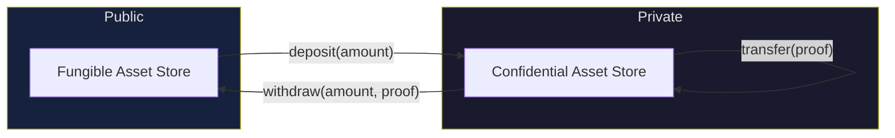


---

## 2. Protocol Overview

### Lifecycle

A user's interaction with confidential assets follows this lifecycle:

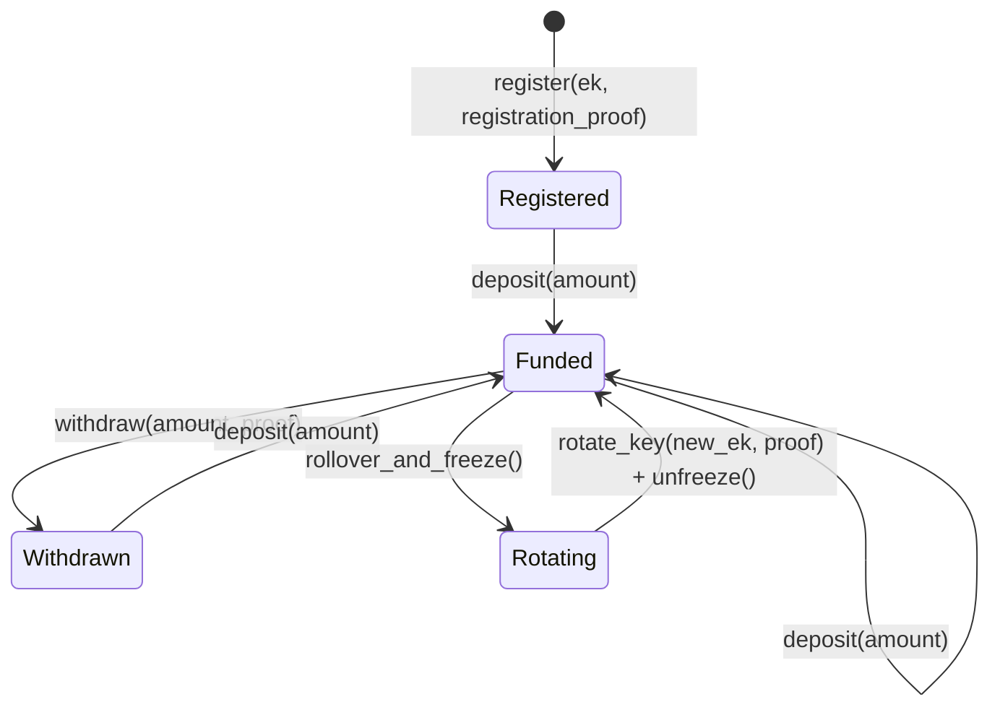


### Dual-Balance Architecture

Each account maintains two encrypted balances to prevent front-running attacks:

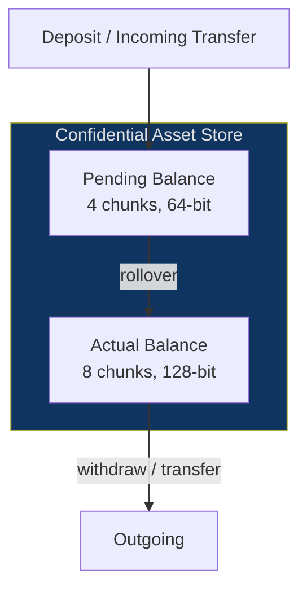


- **Pending balance**: receives deposits and incoming transfers. Cannot be spent directly.
- **Actual balance**: available for spending. Updated by rolling over the pending balance.

This separation ensures that incoming transfers cannot interfere with in-progress proofs, since proofs are computed against the actual balance which is stable between rollovers.

---

## 3. Cryptographic Primitives

### Twisted ElGamal Encryption

Balances are encrypted using a twisted variant of ElGamal encryption over Ristretto255 [RFC 9496](https://www.rfc-editor.org/rfc/rfc9496).

**Key generation:**

$$dk \xleftarrow{R} \mathbb{Z}_q, \quad ek = dk^{-1} \cdot H$$

where $H$ is a **fixed, canonically defined point** on the Ristretto255 group (from `hash_to_point_base` in the implementation): the same kind of object as the usual curve basepoint—it is an element of $\mathbb{G}$ used as a **second base** alongside the standard basepoint $G$ in $C = v \cdot G + r \cdot H$. The label “hash-to-point” refers to *how $H$ is constructed* (deterministic encoding to the group), not to a different mathematical type. Here $dk \in \mathbb{Z}_q$ is the secret **decryption** scalar and $ek \in \mathbb{G}$ is the public **encryption** key (a curve point, stored on-chain as `CompressedPubkey`). The formula comes from Twisted ElGamal in this repository: public key $Y = sk^{-1} \cdot H$ for secret $sk$ ([`ristretto255_twisted_elgamal.move`](./sources/confidential_asset/ristretto255_twisted_elgamal.move))—with $sk = dk$ and $Y = ek$—which is **not** the textbook choice $Y = sk \cdot G$. Equivalently $dk \cdot ek = H$ (scalar multiplication of the point $ek$ by $dk$). If you are used to writing **public = secret $\cdot$ generator**, the twist here is **public = secret$^{-1} \cdot H$** for this second base $H$.

**Encryption of value $v$ with randomness $r$:**

$$C = v \cdot G + r \cdot H, \quad D = r \cdot ek$$

**Homomorphic property:**

$$\text{Enc}(v_1, r_1) + \text{Enc}(v_2, r_2) = \text{Enc}(v_1 + v_2, r_1 + r_2)$$

This allows the blockchain to update encrypted balances without decryption.

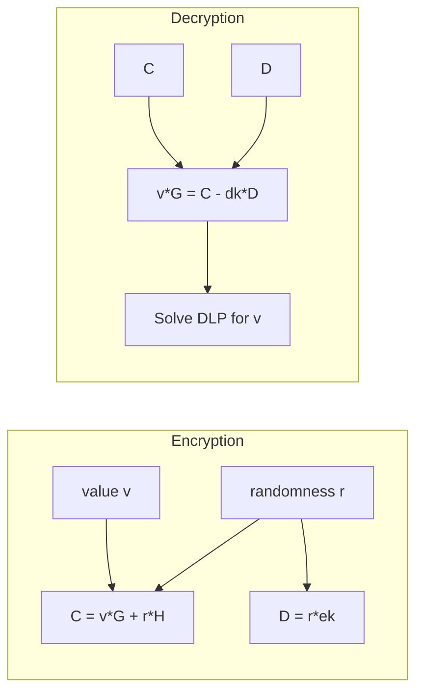


### Bulletproofs Range Proofs

Range proofs ensure that encrypted values lie within valid bounds, preventing overflow/underflow attacks. The protocol uses batch Bulletproofs verification [Bunz et al., 2018](https://eprint.iacr.org/2017/1066) to prove that each 16-bit chunk of a balance is in range $[0, 2^{16})$.

### Ristretto255

All elliptic curve operations use the Ristretto255 group [RFC 9496](https://www.rfc-editor.org/rfc/rfc9496), which provides a prime-order group suitable for cryptographic protocols, built on top of Curve25519.

---

## 4. Balance Representation

### Chunked Encoding

Balances are split into fixed-width chunks to enable efficient range proofs and bounded-complexity decryption:


| Balance Type | Chunks | Bits per Chunk | Total Capacity |
| ------------ | ------ | -------------- | -------------- |
| Pending      | 4      | 16             | 64-bit         |
| Actual       | 8      | 16             | 128-bit        |


A balance value $b$ is decomposed as:

$$b = \sum_{i=0}^{n-1} a_i \cdot 2^{16i}$$

Each chunk $a_i$ is independently encrypted as a twisted ElGamal ciphertext $(C_i, D_i)$.

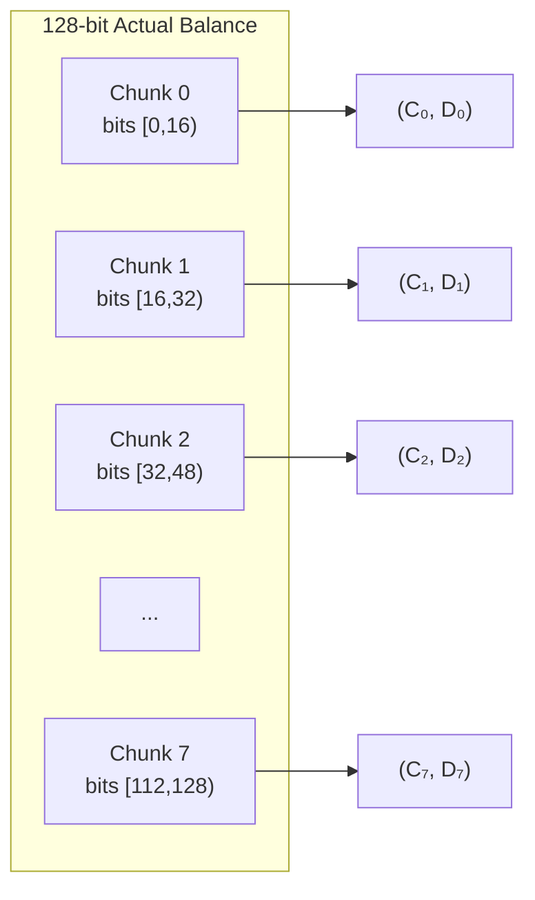


### Normalization

After multiple deposits, chunk values may exceed 16 bits due to homomorphic addition. **Normalization** re-encodes the balance with fresh randomness so all chunks are within $[0, 2^{16})$, accompanied by a zero-knowledge proof that the re-encoded balance represents the same value.

### Pending Counter

A counter tracks incoming transfers to the pending balance. After $2^{16} - 2$ transfers, the user must roll over the pending balance to the actual balance. This bounds the discrete log search space during decryption.

---

## 5. Protocol Operations

### Register

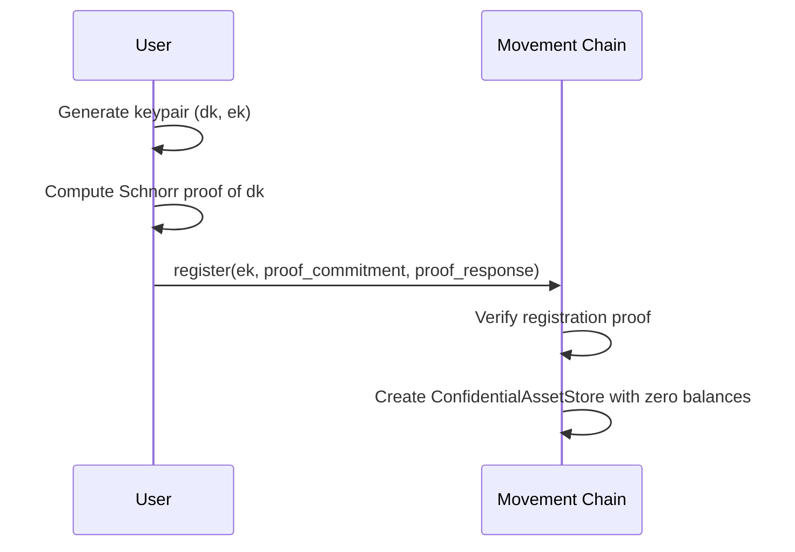


The registration proof prevents an attacker from registering someone else's key or a maliciously crafted key.

### Deposit

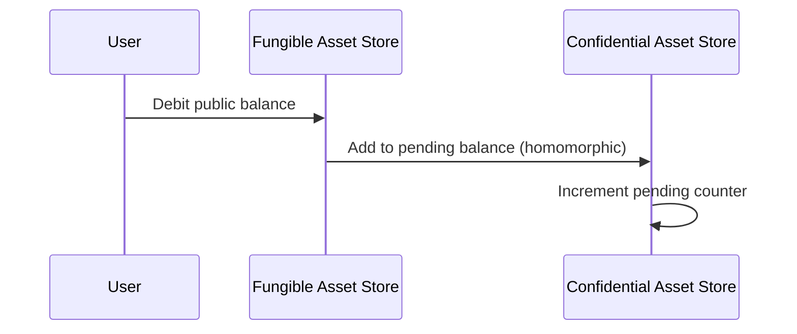


Deposits are public (amount visible on-chain) but become private after rollover into the actual balance.

### Transfer

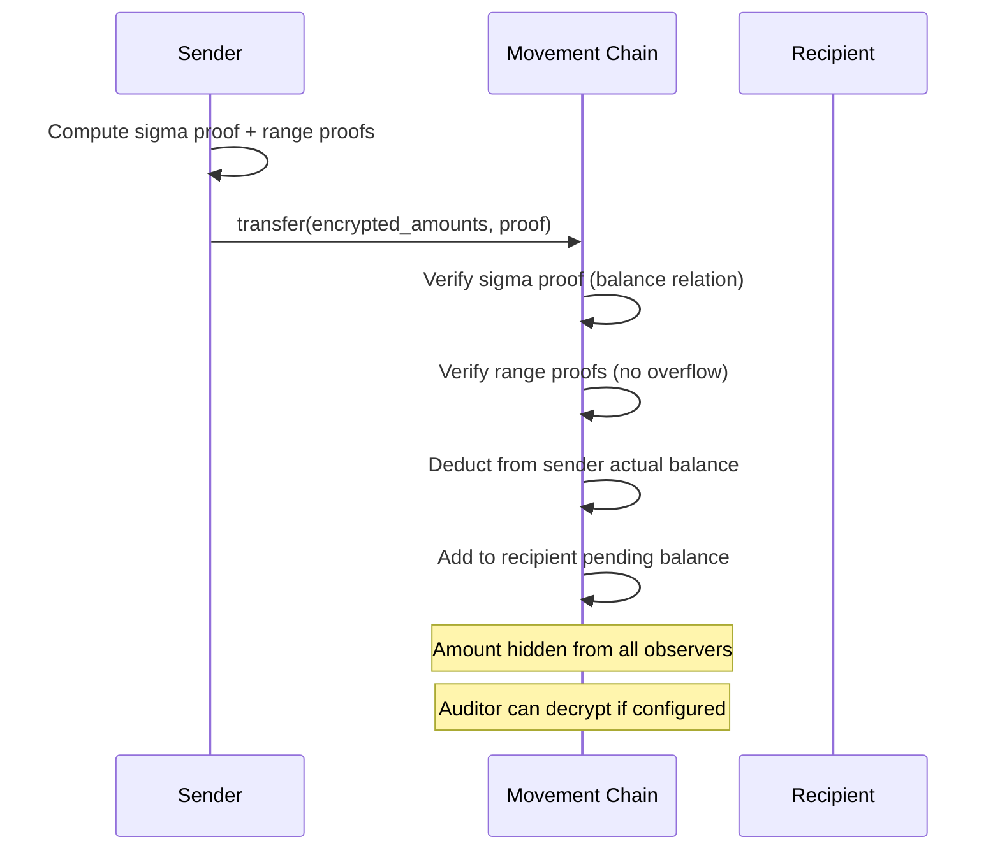


The transfer proof demonstrates:

1. Sender's new balance = old balance - transfer amount
2. Transfer amount encrypted under recipient's key matches sender's committed amount
3. All new balance chunks are in range $[0, 2^{16})$

### Withdraw

The inverse of deposit: the user proves that their encrypted balance contains at least the withdrawal amount, and the difference is properly range-constrained.

### Key Rotation

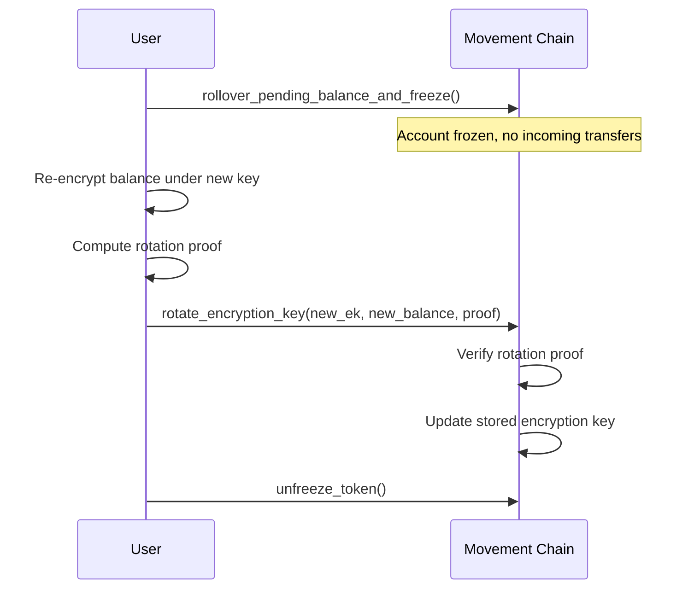


### End-to-End Example: Sending MOVE Privately

This example walks through every on-chain step required for Alice to send MOVE tokens privately to Bob, from start to finish.

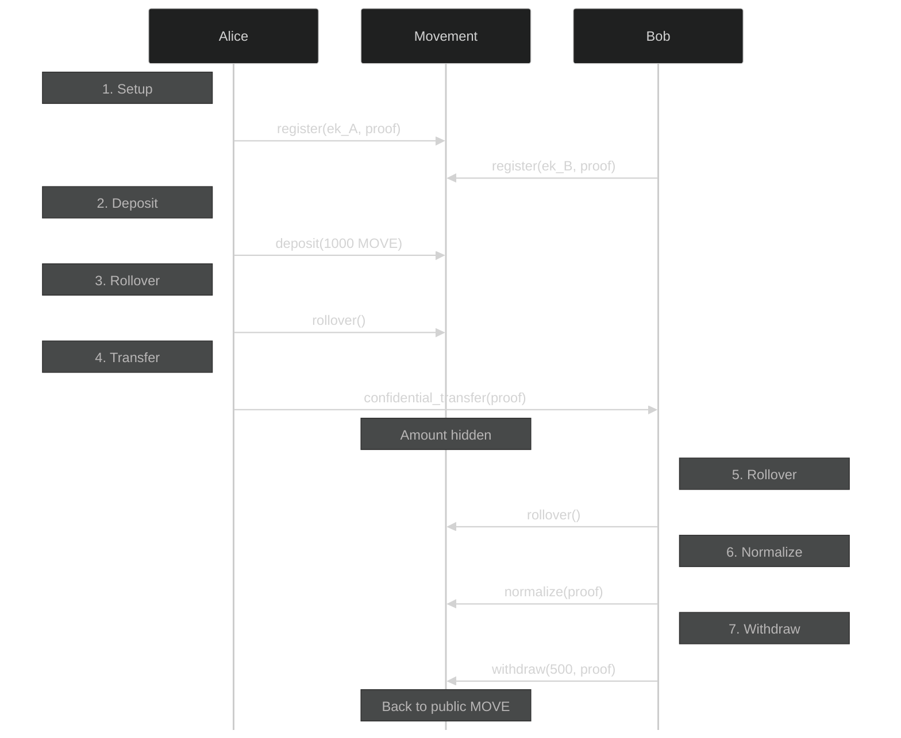


**Summary of transactions:**


| Step | Who   | Transaction                               | Privacy                                |
| ---- | ----- | ----------------------------------------- | -------------------------------------- |
| 1    | Alice | `register(MOVE, ek_A, proof)`             | Public (one-time setup)                |
| 2    | Bob   | `register(MOVE, ek_B, proof)`             | Public (one-time setup)                |
| 3    | Alice | `deposit(MOVE, 1000)`                     | Amount visible (entering private pool) |
| 4    | Alice | `rollover_pending_balance(MOVE)`          | No amount revealed                     |
| 5    | Alice | `confidential_transfer(MOVE, Bob, proof)` | **Amount hidden**                      |
| 6    | Bob   | `rollover_pending_balance(MOVE)`          | No amount revealed                     |
| 7    | Bob   | `normalize(MOVE, ...)`                    | No amount revealed (only if needed)    |
| 8    | Bob   | `withdraw(MOVE, amount, proof)`           | Amount visible (leaving private pool)  |


The deposit (step 3) and withdrawal (step 8) amounts are visible on-chain since they interact with public balances. The transfer (step 5) is the private operation — only the sender, recipient, and optional auditor can determine the amount.

---

## 6. Proof System

### Sigma Protocol Structure

Each operation uses a sigma protocol to prove algebraic relations between encrypted values. All proofs share a common structure:

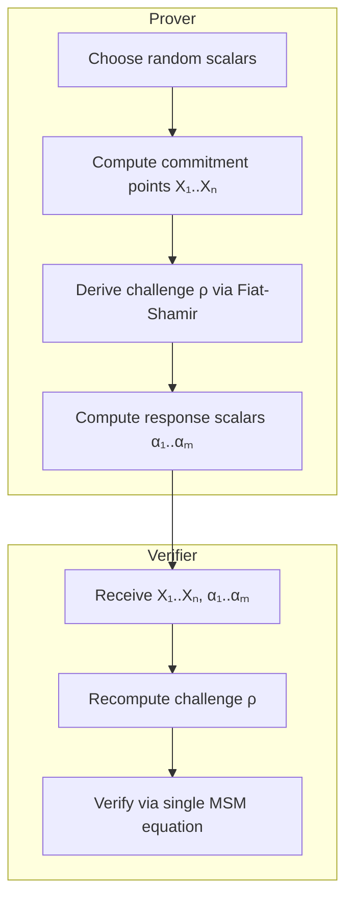


### Multi-Scalar Multiplication (MSM) Verification

Instead of checking multiple separate equations, the verifier combines all relations into a single MSM check using challenge-derived $\gamma$ scalars:

$$\sum_i \gamma_i \cdot X_i = \text{MSM}\left(P_j, s_j\right)$$

where:

- $X_i$ are commitment points from the proof
- $\gamma_i$ are derived from the challenge $\rho$ via SHA3-512
- $P_j$ are public points (bases, balance components, encryption keys)
- $s_j$ are computed scalars combining response scalars, challenges, and public values

This batching reduces verification to a single MSM, which is significantly faster than multiple individual scalar multiplications.

### Proof Components by Operation


| Operation     | Commitment Points | Response Scalars | Range Proofs         | Approx. Size |
| ------------- | ----------------- | ---------------- | -------------------- | ------------ |
| Withdrawal    | 18                | 18               | 1 (new balance)      | ~1.8 KB      |
| Transfer      | 30 + 4n           | 26 + 4n          | 2 (balance + amount) | ~3 KB        |
| Normalization | 18                | 18               | 1 (new balance)      | ~1.8 KB      |
| Rotation      | 19                | 19               | 1 (new balance)      | ~1.9 KB      |
| Registration  | 1                 | 1                | 0                    | 64 bytes     |


*n = number of auditors*

---

## 7. Fiat-Shamir Construction

### Tagged Hashing

The protocol uses BIP-340-style tagged hashing [Wuille et al., 2020](https://github.com/bitcoin/bips/blob/master/bip-0340.mediawiki) with SHA3-512 [NIST FIPS 202](https://nvlpubs.nist.gov/nistpubs/FIPS/NIST.FIPS.202.pdf):

$$\text{taggedhash}(\text{tag}, \text{msg}) = \text{SHA3-512}\left(\text{SHA3-512}(\text{tag})  \text{SHA3-512}(\text{tag})  \text{msg}\right)$$

The double tag hash prefix is precomputable and provides collision resistance between different protocol contexts.

### Domain Separation

Each operation uses a distinct domain separation tag (DST):


| Operation     | DST                                              |
| ------------- | ------------------------------------------------ |
| Registration  | `"MovementConfidentialAsset/Registration"`       |
| Withdrawal    | `"MovementConfidentialAsset/Withdrawal"`         |
| Transfer      | `"MovementConfidentialAsset/Transfer"`           |
| Normalization | `"MovementConfidentialAsset/Normalization"`      |
| Rotation      | `"MovementConfidentialAsset/Rotation"`           |
| Range Proofs  | `"AptosConfidentialAsset/BulletproofRangeProof"` |


### Chain ID and Sender Binding

Every Fiat-Shamir challenge includes the chain ID and sender address as prefix bytes:

$$\rho = \text{taggedhash}\left(\text{DST},\ \text{chainid}  \text{sender}  \text{publicparams}  X_1  \cdots  X_n\right)$$

This binding ensures:

- A proof generated for Movement mainnet cannot be replayed on testnet (or vice versa)
- A proof generated by one sender cannot be replayed by a different sender
- Proofs are tied to the specific transaction context

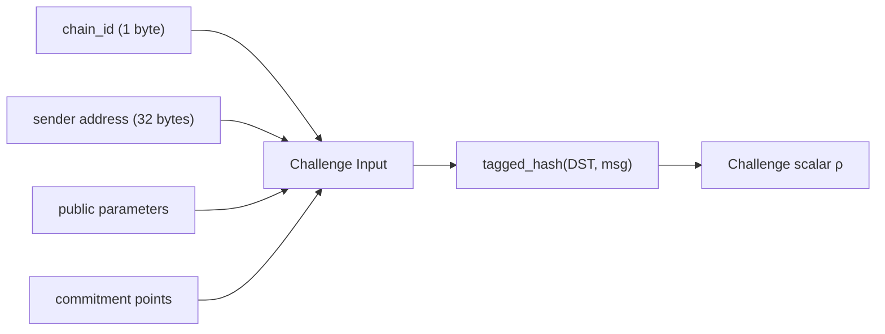


### Gamma Scalar Derivation

For MSM batching, additional scalars $\gamma_i$ are derived from the challenge via SHA3-512:

$$\gamma_i = \text{SHA3-512}(\rho  i)$$

converted to a scalar via `new_scalar_uniform_from_64_bytes`.

---

## 8. Registration Proof

### Motivation

Without a registration proof, an attacker could register an arbitrary encryption key for a victim's account, causing funds sent to that account to be unrecoverable. The registration proof is a Schnorr zero-knowledge proof of knowledge (ZKPoK) proving that the registrant knows the decryption key corresponding to the registered encryption key.

### Protocol

Given keypair $(dk, ek)$ where $ek = dk^{-1} \cdot H$:

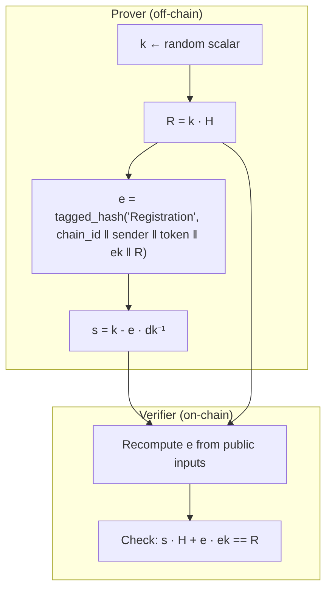


**Verification equation:** $s \cdot H + e \cdot ek = R$

**Correctness:** Substituting $s = k - e \cdot dk^{-1}$ and $ek = dk^{-1} \cdot H$:

$$(k - e \cdot dk^{-1}) \cdot H + e \cdot dk^{-1} \cdot H = k \cdot H = R \quad \checkmark$$

**Proof size:** 64 bytes (32-byte compressed point + 32-byte scalar).

---

## 9. Security Properties

### Balance Privacy

- Transfer amounts are hidden from all observers (validators, other users)
- Only the sender, recipient, and optional auditors can decrypt the amount
- Multiple transfers between the same parties do not leak cumulative information beyond what each party can individually compute

### Proof Soundness

- Sigma protocols prove algebraic relationships with negligible soundness error
- Bulletproofs range proofs prevent overflow/underflow attacks (each chunk proven < $2^{16}$)
- MSM batching via random $\gamma$ scalars preserves soundness with overwhelming probability

### Replay Protection

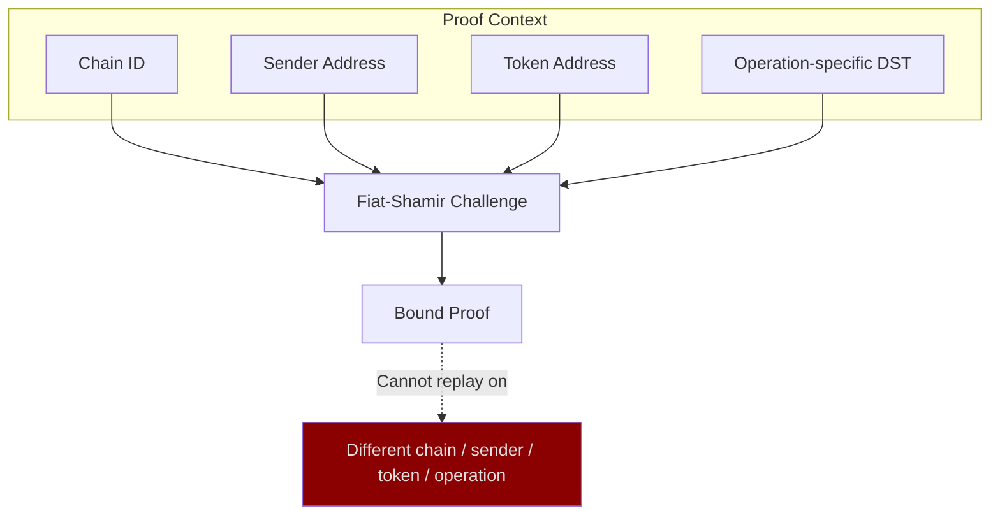


| Attack                 | Mitigation                             |
| ---------------------- | -------------------------------------- |
| Cross-chain replay     | Chain ID in challenge input            |
| Cross-sender replay    | Sender address in challenge input      |
| Cross-operation replay | Operation-specific DST tags            |
| Key registration abuse | Schnorr ZKPoK required at registration |
| Front-running          | Pending/actual balance separation      |
| Chunk overflow         | Normalization + range proofs           |


### Decryption Complexity


| Operation                | DLP Search Space                      |
| ------------------------ | ------------------------------------- |
| Pending chunk decryption | $2^{16} \times \text{pendingcounter}$ |
| Actual chunk decryption  | $2^{16} \times 2^{16} = 2^{32}$       |


The 16-bit chunking ensures decryption remains computationally feasible for the balance holder while remaining infeasible for attackers without the decryption key.

---

## 10. Differences from Aptos

The Movement implementation diverges from Aptos's post-November 2025 proprietary changes while achieving equivalent security properties.

### Comparison

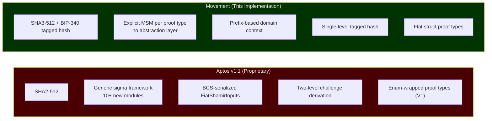


| Component               | Aptos v1.1 (Proprietary)                                                                         | Movement                                                                         | Public Basis                                                                                                                                      |
| ----------------------- | ------------------------------------------------------------------------------------------------ | -------------------------------------------------------------------------------- | ------------------------------------------------------------------------------------------------------------------------------------------------- |
| **Hash function**       | SHA2-512                                                                                         | SHA3-512                                                                         | [NIST FIPS 202](https://nvlpubs.nist.gov/nistpubs/FIPS/NIST.FIPS.202.pdf)                                                                         |
| **Domain separation**   | `DomainSeparator` enum with chain_id, contract address, protocol_id, session_id — BCS-serialized | BIP-340 tagged hash with chain_id + sender address prefix                        | [BIP-340](https://github.com/bitcoin/bips/blob/master/bip-0340.mediawiki)                                                                         |
| **Challenge structure** | Two-level: seed then derived challenges                                                          | Single-level tagged hash: `SHA3-512(tag_hash || tag_hash || msg)`                | [Fiat & Shamir, 1986](https://link.springer.com/chapter/10.1007/3-540-47721-7_12)                                                                 |
| **Sigma framework**     | Generic modules: `sigma_protocol.move`, `sigma_protocol_homomorphism.move`, etc.                 | Explicit MSM verification per proof type — no abstraction layer, easier to audit | [Schnorr, 1991](https://link.springer.com/article/10.1007/BF00196725); [Cramer, 1996](https://link.springer.com/chapter/10.1007/3-540-68339-9_19) |
| **Registration proof**  | `sigma_protocol_registration.move` via generic framework                                         | Inline Schnorr verification in `confidential_proof.move`                         | [Schnorr, 1989](https://link.springer.com/chapter/10.1007/0-387-34805-0_22)                                                                       |
| **Module location**     | Moved to `aptos-framework`                                                                       | Remains in `aptos-experimental`                                                  | N/A                                                                                                                                               |
| **Proof types**         | Enum-wrapped with V1 variants                                                                    | Flat struct types                                                                | N/A                                                                                                                                               |


### What Was Inherited (Apache 2.0 Licensed)

The following components predate Aptos's November 2025 license change and are used under their original Apache 2.0 license:

- Twisted ElGamal encryption scheme and chunked balance representation
- Core sigma protocol verification structure (MSM equations, gamma batching)
- Bulletproofs range proof integration
- Ristretto255 curve operations (`aptos_std::ristretto255`)
- Fungible asset integration patterns

### What Movement Changed

The following changes were made to the inherited pre-license-change codebase. The original Aptos code did not include chain ID binding or a registration proof; Aptos added these independently in their proprietary v1.1 update. Movement's implementations are structurally different clean-room designs.

- **Hash function**: SHA2-512 replaced with SHA3-512 throughout Fiat-Shamir
- **Tagged hashing**: BIP-340 double-tag construction added
- **Chain ID binding**: All challenges now include chain_id and sender address (the inherited code had neither)
- **Registration proof**: New Schnorr ZKPoK requirement for key registration (the inherited code had no registration proof)
- **DST branding**: Tags changed from `"AptosConfidentialAsset/"` to `"MovementConfidentialAsset/"`

**Note:** The Bulletproofs range proof DST (`"AptosConfidentialAsset/BulletproofRangeProof"`) is unchanged from the inherited code because range proofs are verified by the pre-existing `ristretto255_bulletproofs` native module, and changing the DST would require matching changes in the native layer.

---

## 11. IP Status and References

All cryptographic primitives used are published, public-domain, or open-standard. No proprietary Aptos code (post-November 2025) was used.


| Primitive                      | Reference                                                                                                                                                                                                                                                      | Status                              |
| ------------------------------ | -------------------------------------------------------------------------------------------------------------------------------------------------------------------------------------------------------------------------------------------------------------- | ----------------------------------- |
| **SHA3-512**                   | [NIST FIPS 202](https://nvlpubs.nist.gov/nistpubs/FIPS/NIST.FIPS.202.pdf), "SHA-3 Standard: Permutation-Based Hash and Extendable-Output Functions", August 2015                                                                                               | NIST standard, royalty-free         |
| **BIP-340 tagged hashing**     | [Wuille, Nick, Towns, "Schnorr Signatures for secp256k1", BIP-340, January 2020](https://github.com/bitcoin/bips/blob/master/bip-0340.mediawiki)                                                                                                               | Open standard (Bitcoin)             |
| **Schnorr proof of knowledge** | [Schnorr, "Efficient Signature Generation by Smart Cards", J. Cryptology 4(3):161-174, 1991](https://link.springer.com/article/10.1007/BF00196725)                                                                                                             | Public domain (patent expired 2008) |
| **Fiat-Shamir transform**      | [Fiat & Shamir, "How to Prove Yourself: Practical Solutions to Identification and Signature Problems", CRYPTO 1986](https://link.springer.com/chapter/10.1007/3-540-47721-7_12)                                                                                | Public domain                       |
| **Ristretto255**               | [RFC 9496, "The ristretto255 and decaf448 Groups", December 2023](https://www.rfc-editor.org/rfc/rfc9496)                                                                                                                                                      | Open standard (IRTF)                |
| **Bulletproofs**               | [Bunz, Bootle, Boneh, Poelstra, Wuille, Maxwell, "Bulletproofs: Short Proofs for Confidential Transactions and More", IEEE S&P 2018](https://eprint.iacr.org/2017/1066)                                                                                        | Patent-free                         |
| **Twisted ElGamal**            | [ElGamal, "A Public Key Cryptosystem and a Signature Scheme Based on Discrete Logarithms", IEEE IT 1985](https://ieeexplore.ieee.org/document/1057074); twisted variant per [Pedersen, CRYPTO 1991](https://link.springer.com/chapter/10.1007/3-540-46766-1_9) | Public domain                       |
| **BCS serialization**          | [Diem/Libra BCS, Apache 2.0](https://github.com/diem/bcs)                                                                                                                                                                                                      | Permissive open source              |
| **Curve25519**                 | [Bernstein, "Curve25519: New Diffie-Hellman Speed Records", PKC 2006](https://cr.yp.to/ecdh/curve25519-20060209.pdf)                                                                                                                                           | Public domain                       |


### Non-Infringement Statement

1. **No sigma protocol framework adopted.** Aptos v1.1 introduced 10+ new Move modules (`sigma_protocol*.move`) implementing a generic homomorphism-based prover/verifier. Movement does not use any of these modules. Verification logic remains in `confidential_proof.move` using direct MSM equations.
2. **Different hash function and construction.** Movement uses SHA3-512 (NIST FIPS 202) with BIP-340 tagged hashing. Aptos uses SHA2-512 with BCS-serialized input structs and a two-level derivation. These are structurally different constructions.
3. **Pre-existing code base.** The proof verification structure (MSM equations, gamma batching, deserialization) predates Aptos's November 2025 license change. Movement's modifications add chain ID parameters and switch the hash function; they do not adopt any v1.1 architectural patterns.
4. **Registration proof is standard Schnorr.** The discrete-log proof of knowledge ($s \cdot H + e \cdot ek = R$) is a textbook Schnorr protocol (1989/1991), not derived from Aptos's `sigma_protocol_registration.move`.
5. **The `aptos_hash::sha3_512()` native function and `ristretto255::new_scalar_uniform_from_64_bytes()` are pre-existing framework primitives** available under the original Apache 2.0 license.

---

## Appendix A: Protocol Constants

```
MAX_TRANSFERS_BEFORE_ROLLOVER  = 65534     (2^16 - 2)
PENDING_BALANCE_CHUNKS         = 4         (64-bit capacity)
ACTUAL_BALANCE_CHUNKS          = 8         (128-bit capacity)
CHUNK_SIZE_BITS                = 16
BULLETPROOFS_NUM_BITS          = 16
BULLETPROOFS_DST               = "AptosConfidentialAsset/BulletproofRangeProof"
```

