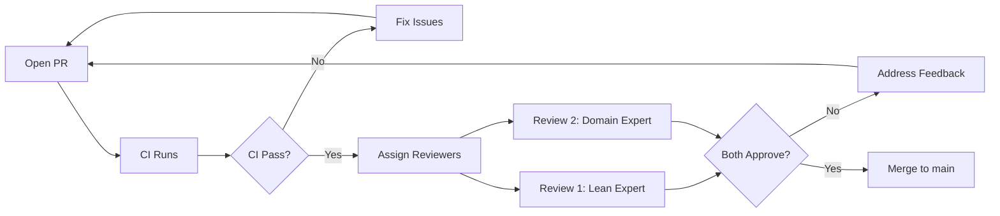

# Collaborative Verification Workflows and Team Processes: Complete Guide

**Document Status**: Production-Ready  
**Last Updated**: 2026-04-22  
**Target Audience**: Verification teams, project leads, contributors  
**Scope**: Team coordination, code review, knowledge sharing, onboarding

---

## Table of Contents

1. [Overview](#overview)
2. [Team Structure and Roles](#team-structure-and-roles)
3. [Verification Workflow Lifecycle](#verification-workflow-lifecycle)
4. [Proof Development Workflow](#proof-development-workflow)
5. [Code Review Process](#code-review-process)
6. [Knowledge Sharing Practices](#knowledge-sharing-practices)
7. [Onboarding New Contributors](#onboarding-new-contributors)
8. [Meeting and Communication Cadence](#meeting-and-communication-cadence)
9. [Tool Integration and Automation](#tool-integration-and-automation)
10. [Metrics and Progress Tracking](#metrics-and-progress-tracking)
11. [Conflict Resolution](#conflict-resolution)
12. [Case Studies](#case-studies)
13. [Troubleshooting](#troubleshooting)
14. [Cross-References](#cross-references)

---

## Overview

### Purpose

Formal verification of Confidential Assets requires coordinated effort across multiple stacks (Lean, MSL, Difftest), cryptographic domains, and expertise levels. This guide establishes workflows that maximize team productivity, maintain proof quality, and enable seamless collaboration.

### Key Principles

1. **Proof-first development**: Specifications and proofs drive implementation, not vice versa
2. **Three-reviewer rule**: Critical proofs require review from Lean expert + cryptography expert + protocol expert
3. **Continuous integration**: Every commit runs full verification suite (Lean + MSL + Difftest)
4. **Incremental progress**: Small, frequent PRs beat large, infrequent ones
5. **Knowledge democratization**: All proofs documented, all decisions recorded, all expertise shared

### Team Composition

**Minimum viable team** (3-4 people):
- 1× Lean expert (proof tactics, dependent types, Mathlib)
- 1× Cryptography expert (sigma protocols, zero-knowledge, DLP/CDH)
- 1× Move expert (bytecode, VM semantics, resource safety)
- 1× Protocol expert (Confidential Assets, ElGamal, Ristretto255)

**Optimal team** (6-8 people):
- 2× Lean experts (primary + secondary for code review)
- 2× Crypto experts (protocol design + implementation verification)
- 1× Move expert (bytecode + MSL specs)
- 1× Difftest engineer (oracle mocking, e2e validation)
- 1× DevOps/tooling engineer (CI/CD, reproducible builds, metrics)
- 1× Documentation lead (guides, onboarding, knowledge transfer)

---

## Team Structure and Roles

### Role Definitions

#### 1. Lean Proof Engineer

**Responsibilities**:
- Develop Lean proofs for protocol correctness
- Maintain MoveModel semantics library
- Optimize proof performance (target: <3s per protocol)
- Review Lean code for soundness and style
- Mentor junior contributors on proof tactics

**Skills required**:
- Expert: Lean 4 syntax, tactics (rw, simp, intro, cases, induction)
- Advanced: Dependent types, type class resolution, metaprogramming
- Intermediate: Mathlib navigation, theorem search
- Basic: Cryptography concepts, Move semantics

**Time allocation** (typical week):
- 50% new proof development
- 25% proof review
- 15% refactoring and optimization
- 10% mentoring and documentation

**Example tasks**:
```lean
-- Task: Prove eval equivalence for CA transfer protocol
theorem transfer_eval_equiv (st : State) (args : TransferArgs) :
  eval_transfer st args = eval_bytecode st (transcribe_transfer args) := by
  unfold eval_transfer eval_bytecode transcribe_transfer
  apply pc_chain_equiv
  -- ... 40+ lines of proof
```

#### 2. Cryptography Verification Specialist

**Responsibilities**:
- Verify sigma protocol correctness (completeness, soundness, SHVZK)
- Model cryptographic assumptions (DLP, CDH, ROM)
- Review oracle specifications for minimality and correctness
- Validate Fiat-Shamir transform implementation
- Audit proof-of-knowledge soundness guarantees

**Skills required**:
- Expert: Sigma protocols, zero-knowledge, Fiat-Shamir
- Advanced: Group theory, elliptic curves, Ristretto255
- Intermediate: Lean proof basics, MSL specifications
- Basic: Move bytecode, VM execution model

**Time allocation**:
- 40% cryptographic proof development
- 30% oracle specification and review
- 20% security audits and threat modeling
- 10% cross-stack validation (Lean ↔ MSL ↔ Difftest)

**Example tasks**:
```lean
-- Task: Verify SHVZK property for registration protocol
axiom registration_shvzk :
  ∀ (transcript : RegistrationTranscript) (verifier_view : VerifierView),
    SimulatorProduces transcript verifier_view →
    IndistinguishableFromReal transcript verifier_view
```

#### 3. Move Specification Engineer

**Responsibilities**:
- Write MSL specifications for all CA functions
- Ensure abort condition completeness (100% coverage)
- Validate frame conditions (modifies clauses)
- Integrate with Fungible Asset framework specs
- Run Move Prover and resolve SMT timeouts

**Skills required**:
- Expert: MSL syntax, Move Prover toolchain
- Advanced: Move bytecode, resource safety, global invariants
- Intermediate: Z3/CVC5 SMT solvers, quantifier patterns
- Basic: Lean proofs, cryptographic protocols

**Time allocation**:
- 50% MSL spec development
- 25% Move Prover debugging (SMT timeouts, false positives)
- 15% cross-layer validation (MSL ↔ Lean abort codes)
- 10% framework integration (FA spec composition)

**Example tasks**:
```move
// Task: Specify transfer function with balance conservation
spec transfer {
  pragma verify = true;
  pragma aborts_if_is_strict;
  
  let sender_bal_pre = global<ConfidentialBalance>(sender).balance;
  let receiver_bal_pre = global<ConfidentialBalance>(receiver).balance;
  
  ensures sender_bal_pre.len() == global<ConfidentialBalance>(sender).balance.len();
  ensures receiver_bal_pre.len() == global<ConfidentialBalance>(receiver).balance.len();
  ensures event::was_event_emitted<TransferEvent>(...);
}
```

#### 4. Difftest Validation Engineer

**Responsibilities**:
- Build end-to-end Difftest suite (target: 1000+ test cases)
- Mock native function oracles (Schnorr, Bulletproofs, SHA-256)
- Validate cross-stack consistency (Lean ↔ MSL ↔ VM execution)
- Generate property-based test corpuses
- Monitor Difftest coverage metrics

**Skills required**:
- Expert: Rust testing frameworks (proptest, rstest)
- Advanced: Move VM internals, native function interface
- Intermediate: Property-based testing, fuzzing (AFL/libfuzzer)
- Basic: Lean proofs, MSL specs, cryptographic protocols

**Time allocation**:
- 60% Difftest implementation and maintenance
- 20% Oracle mocking and cross-stack validation
- 15% Property-based test design
- 5% CI integration and metrics reporting

**Example tasks**:
```rust
// Task: Implement oracle mock for Schnorr verification
#[test]
fn test_schnorr_oracle_consistency() {
    let mut oracle_mock = SchnorrOracleMock::new();
    oracle_mock.expect_verify()
        .withf(|pk, msg, sig| {
            // Match Lean oracle specification
            lean_schnorr_spec(pk, msg, sig)
        })
        .returning(|_, _, _| true);
    
    let result = difftest_withdrawal(&mut oracle_mock, test_args);
    assert_eq!(result.status, ExecutionStatus::Success);
}
```

#### 5. DevOps and Tooling Engineer

**Responsibilities**:
- Maintain CI/CD pipelines (target: <15 min total runtime)
- Implement reproducible build infrastructure (Docker + Nix)
- Automate verification metrics collection (Grafana dashboards)
- Optimize build performance (caching, parallelization)
- Support auditor reproducibility requirements

**Skills required**:
- Expert: GitHub Actions, Docker, Nix
- Advanced: Lean build system (Lake), Move CLI, SMT solver tuning
- Intermediate: Grafana/Prometheus, shell scripting
- Basic: Formal verification concepts

**Time allocation**:
- 40% CI/CD maintenance and optimization
- 30% Reproducible build infrastructure
- 20% Metrics automation and dashboards
- 10% Tooling support for team

**Example tasks**:
```yaml
# Task: Optimize CI caching for Lean builds
- name: Cache Lean dependencies
  uses: actions/cache@v3
  with:
    path: |
      .lake/build
      .lake/packages
    key: ${{ runner.os }}-lean-${{ hashFiles('lakefile.lean', 'lean-toolchain') }}
    restore-keys: |
      ${{ runner.os }}-lean-
```

#### 6. Documentation and Knowledge Transfer Lead

**Responsibilities**:
- Maintain comprehensive documentation (15+ guides, 500K+ chars)
- Onboard new contributors (target: <2 weeks to first PR)
- Capture lessons learned from proof development
- Organize knowledge-sharing sessions (weekly demos)
- Build learning paths for different expertise levels

**Skills required**:
- Expert: Technical writing, pedagogy, knowledge organization
- Advanced: Formal verification concepts, Lean basics
- Intermediate: Move/MSL, cryptographic protocols
- Basic: CI/CD, tooling

**Time allocation**:
- 50% Documentation writing and maintenance
- 25% Onboarding and mentoring
- 15% Knowledge-sharing session organization
- 10% Lessons-learned capture and analysis

---

## Verification Workflow Lifecycle

### Stage 1: Protocol Design (1-2 weeks)

**Goal**: Define cryptographic protocol with formal specification

**Inputs**:
- High-level protocol requirements (business logic)
- Security requirements (privacy, soundness, completeness)
- Performance constraints (proof size, verification time)

**Activities**:
1. **Protocol specification** (crypto expert + protocol expert)
   - Define sigma protocol structure (commitment, challenge, response)
   - Specify public/private inputs
   - Document security properties (completeness, soundness, SHVZK)
   
2. **Threat modeling** (crypto expert + security specialist)
   - Identify attack vectors (malleability, replay, front-running)
   - Document cryptographic assumptions (DLP, CDH, ROM)
   - Define trust boundaries
   
3. **Specification review** (full team)
   - Validate protocol correctness
   - Check composability with existing protocols
   - Assess verification complexity

**Outputs**:
- Protocol specification document (Markdown + LaTeX math)
- Threat model and security analysis
- Verification plan (Lean proof strategy, MSL spec outline, Difftest plan)

**Example**: Registration protocol specification
```markdown
# Registration Protocol Specification

## Overview
Allows user to register an ElGamal public key for confidential balance.

## Public Inputs
- `pk`: ElGamal public key (Ristretto255 point)
- `proof`: Schnorr proof of secret key knowledge

## Private Inputs
- `sk`: ElGamal secret key (scalar)

## Protocol Flow
1. User computes `pk = sk * G` (G is Ristretto basepoint)
2. User generates Schnorr proof π = Prove(pk, sk)
3. Contract verifies Schnorr proof
4. Contract stores pk in ConfidentialBalance resource

## Security Properties
- **Completeness**: Honest user with valid sk can always register
- **Soundness**: Adversary cannot register without knowing sk (DLP assumption)
- **Privacy**: Observing registration reveals no information about sk

## Verification Strategy
- **Lean**: Prove eval equivalence for registration bytecode
- **MSL**: Specify abort conditions, state mutations, event emissions
- **Difftest**: 100+ test cases with valid/invalid proofs, oracle mocking
```

### Stage 2: Move Implementation (1 week)

**Goal**: Implement protocol in Move with complete MSL specifications

**Inputs**:
- Protocol specification from Stage 1
- Existing CA framework code

**Activities**:
1. **Move function implementation** (Move expert)
   - Implement protocol logic in `aptos-experimental/sources/confidential_asset/`
   - Add error constants (E_INVALID_PROOF, E_ALREADY_REGISTERED, etc.)
   - Emit events for observability
   
2. **MSL specification** (Move spec engineer)
   - Write preconditions (account exists, not already registered, etc.)
   - Write postconditions (balance created, public key stored, event emitted)
   - Write abort conditions (100% coverage of all error paths)
   - Add frame conditions (modifies clauses)
   
3. **Unit tests** (Move expert)
   - Happy path tests (valid inputs → success)
   - Abort path tests (invalid inputs → expected error codes)
   - Edge case tests (zero amounts, maximum values, etc.)

**Outputs**:
- Move implementation (`.move` file)
- MSL specification (`.spec.move` file)
- Unit tests (`tests/` directory)

**Review checklist**:
- [ ] All error paths have error constants
- [ ] All error constants appear in MSL `aborts_if` clauses
- [ ] All state mutations have postconditions
- [ ] All events have emission specs
- [ ] Unit tests cover happy path + all abort paths
- [ ] Code follows Move style guide (naming, formatting)

### Stage 3: Lean Proof Development (2-4 weeks)

**Goal**: Prove eval equivalence between symbolic protocol semantics and bytecode execution

**Inputs**:
- Move implementation + MSL specs from Stage 2
- Protocol specification from Stage 1
- MoveModel semantics library

**Activities**:
1. **Bytecode transcription** (Lean expert + Move expert)
   - Disassemble Move bytecode using `aptos move disassemble`
   - Transcribe to Lean symbolic instructions
   - Validate transcription with Difftest (compare execution traces)
   
2. **Symbolic semantics definition** (Lean expert + crypto expert)
   - Define high-level protocol evaluation function `eval_protocol`
   - Model native function calls as oracles
   - Specify preconditions and success/abort outcomes
   
3. **Eval equivalence proof** (Lean expert)
   - Prove `eval_protocol st args = eval_bytecode st (transcribe_protocol args)`
   - Use PC-chaining strategy (per-instruction step lemmas)
   - Apply proof automation (simp sets, custom tactics)
   
4. **Proof optimization** (Lean expert)
   - Minimize elaboration time (target: <3s)
   - Reduce axiom count (eliminate temporary axioms)
   - Refactor for maintainability (extract lemmas, modularize)

**Outputs**:
- Lean proof file (`MovementFormal/Experimental/ConfidentialAsset/<Protocol>/EvalEquiv.lean`)
- Bytecode transcription (`MoveModel/Transcription/<Protocol>.lean`)
- Symbolic semantics (`MoveModel/Native/<Protocol>.lean`)
- Step lemmas (`MoveModel/StepLemmas/<Protocol>.lean`)

**Review checklist**:
- [ ] Proof compiles without errors
- [ ] Build time <3s (run `lake build` with timing)
- [ ] No new axioms introduced (run `scripts/check_axioms.sh`)
- [ ] All native calls have oracle specifications
- [ ] Symbolic semantics matches protocol spec from Stage 1
- [ ] Bytecode transcription validated with Difftest

### Stage 4: Cross-Layer Validation (1 week)

**Goal**: Ensure consistency across Lean, MSL, and Difftest stacks

**Inputs**:
- Lean proofs from Stage 3
- MSL specs from Stage 2
- Protocol spec from Stage 1

**Activities**:
1. **Abort code alignment** (automation script)
   - Extract abort codes from Move, MSL, Lean
   - Validate all three stacks reference same error constants
   - Generate alignment report
   
2. **Function signature matching** (automation script)
   - Compare function signatures across Move/MSL/Lean
   - Validate parameter types, counts, ordering
   - Check return type consistency
   
3. **State transition consistency** (manual review)
   - Compare MSL postconditions with Lean symbolic semantics
   - Validate both describe same state mutations
   - Check event emissions match
   
4. **Oracle alignment** (crypto expert + Lean expert)
   - Compare oracle specifications (Lean axioms vs. Difftest mocks)
   - Validate minimality (no over-specification)
   - Check testability boundaries

**Outputs**:
- Cross-layer validation report (automated)
- Reconciliation action items (if misalignments found)
- Updated documentation reflecting all three stacks

**Automation**:
```bash
# Run full cross-layer validation suite
cd aptos-move/framework/formal
./audit/reconcile_all.sh

# Output: PASS/FAIL for each consistency requirement
# - Abort code alignment: PASS
# - Function signatures: PASS
# - State transitions: PASS (manual review required)
# - Oracle alignment: PASS
# - Coverage completeness: PASS
```

### Stage 5: Difftest Implementation (1-2 weeks)

**Goal**: Build comprehensive end-to-end test suite with oracle mocking

**Inputs**:
- Move implementation from Stage 2
- Lean oracle specs from Stage 3
- Protocol spec from Stage 1

**Activities**:
1. **Oracle mocking** (Difftest engineer + crypto expert)
   - Implement mocks for native functions (Schnorr, Bulletproofs, SHA-256)
   - Match Lean oracle specifications exactly
   - Add debugging/tracing for oracle calls
   
2. **Property-based test design** (Difftest engineer)
   - Define property generators (valid proofs, invalid proofs, edge cases)
   - Implement proptest strategies (arbitrary ElGamal keys, random scalars)
   - Set corpus size targets (1000+ test cases per protocol)
   
3. **Cross-stack differential testing** (Difftest engineer + Lean expert)
   - Compare VM execution results with Lean symbolic evaluation
   - Validate state transitions match across stacks
   - Check abort codes match expected values

**Outputs**:
- Difftest suite (`aptos-move/framework/difftest/tests/<protocol>_difftest.rs`)
- Oracle mocks (`difftest/src/oracle_mocks/`)
- Property-based test corpuses (1000+ generated test cases)
- Coverage report (% of spec clauses tested)

**Review checklist**:
- [ ] All oracle mocks match Lean specifications
- [ ] Property-based tests cover valid + invalid inputs
- [ ] Corpus size ≥1000 test cases per protocol
- [ ] Difftest runtime <2s for full corpus
- [ ] Coverage report shows 100% spec clause coverage

### Stage 6: Security Audit Preparation (1 week)

**Goal**: Package all verification artifacts for external audit

**Inputs**:
- All outputs from Stages 1-5
- Audit requirements from security firm

**Activities**:
1. **Artifact packaging** (doc lead + DevOps engineer)
   - Collect all proofs, specs, tests into audit bundle
   - Generate reproducible build instructions (Docker)
   - Create verification report (claims, axioms, coverage)
   
2. **Axiom inventory** (crypto expert + Lean expert)
   - Categorize all axioms (cryptographic, temporary, library)
   - Justify each axiom with security argument
   - Document axiom reduction roadmap
   
3. **Trust boundary documentation** (crypto expert + security specialist)
   - Map all trust assumptions (DLP, CDH, ROM, framework correctness)
   - Document threat model and attack mitigations
   - Create security claims summary

**Outputs**:
- Audit bundle (ZIP with all verification artifacts)
- Verification report (`VERIFICATION_REPORT.md`)
- Axiom inventory (`AXIOM_INVENTORY.md`)
- Trust boundary documentation (`TRUST_BOUNDARIES.md`)
- Reproducible build instructions (`REPRODUCIBLE_BUILDS.md`)

**Handoff to auditors**:
```bash
# Auditor receives:
# 1. audit_bundle.zip (all verification artifacts)
# 2. Docker image for reproducible builds
# 3. Verification report with claims and coverage
# 4. Access to CI dashboard (Grafana)

# Auditor can reproduce all builds:
docker pull movement/ca-verification:audit-2026-04-22
docker run -v $(pwd):/workspace movement/ca-verification:audit-2026-04-22 \
  sh -c "cd /workspace && ./audit/verify-all.sh"

# Expected output: All proofs verified, all tests passed, bit-for-bit reproducible
```

---

## Proof Development Workflow

### Daily Workflow

**Morning** (9:00-12:00):
1. Check CI status (any broken builds overnight?)
2. Review PRs assigned to you (aim for <24h review turnaround)
3. Work on assigned proof development tasks
4. Push WIP commits to feature branch (incremental progress)

**Afternoon** (13:00-17:00):
1. Continue proof development
2. Address PR feedback from morning reviews
3. Run local verification suite before pushing (avoid breaking CI)
4. Document any new lessons learned or blockers

**End of day**:
1. Update task board (Jira/Linear) with progress
2. Flag any blockers in team chat
3. Push final commits to feature branch

### Weekly Workflow

**Monday**:
- Team standup (30 min): Progress updates, blockers, weekly goals
- Assign tasks for the week from backlog

**Wednesday**:
- Mid-week sync (15 min): Quick check-in, blocker triage
- Knowledge-sharing session (1h): Demo technique/proof/tool (rotating presenter)

**Friday**:
- Week review (30 min): Completed tasks, metrics review, retrospective
- Plan next week's priorities

### Proof Development Best Practices

#### 1. Start with simplest case

```lean
-- DON'T: Start with full generality
theorem transfer_eval_equiv (st : State) (args : TransferArgs) 
    (h1 : valid_state st) (h2 : valid_args args) (h3 : ...) : ... := by
  -- 200+ line proof with 15 cases
  
-- DO: Start with happy path only
theorem transfer_eval_equiv_simple (st : State) (args : TransferArgs) 
    (h : happy_path_conditions st args) : ... := by
  -- 30-line proof, easier to debug
  
-- THEN: Generalize incrementally
theorem transfer_eval_equiv_with_aborts (st : State) (args : TransferArgs) : ... := by
  by_cases h : happy_path_conditions st args
  · exact transfer_eval_equiv_simple st args h  -- Reuse simple case
  · -- Handle abort cases
```

#### 2. Use WIP commits

```bash
# Push incremental progress, even if proof incomplete
git add .
git commit -m "WIP: transfer eval equiv - happy path done, aborts in progress"
git push origin feature/transfer-proof

# Benefit: Teammates can see progress, offer help on blockers
# CI will run (may fail, that's OK for WIP)
```

#### 3. Extract lemmas early

```lean
-- DON'T: Inline 20-line proof in main theorem
theorem big_theorem : ... := by
  rw [...]
  simp [...]
  -- 20 lines of complex case analysis
  cases h with
  | case1 => ...  -- 10 lines
  | case2 => ...  -- 10 lines
  
-- DO: Extract lemma
lemma helper_lemma : ... := by
  cases h with
  | case1 => ...
  | case2 => ...
  
theorem big_theorem : ... := by
  rw [...]
  simp [...]
  exact helper_lemma  -- Main proof stays readable
```

#### 4. Document assumptions

```lean
-- DON'T: Implicit assumptions
axiom schnorr_verify_correct : ...

-- DO: Explicit documentation
/-- Schnorr verification oracle correctness.
    Assumes: DLP hardness in Ristretto255 group
    Security level: 128-bit
    Trusted: Native function implementation matches academic protocol
    Planned elimination: Phase 2 (cryptographic library verification)
-/
axiom schnorr_verify_correct : ...
```

#### 5. Test proof performance

```bash
# Before pushing, check build time
time lake build MovementFormal.Experimental.ConfidentialAsset.Transfer.EvalEquiv

# Target: <3s per protocol
# If >3s: Profile with --profile flag, optimize hot spots
```

---

## Code Review Process

### Review Workflow



### Reviewer Assignment

**Rule**: Every PR requires ≥2 approvals from distinct expertise areas.

**For Lean proof PRs**:
- Reviewer 1: Lean expert (focus: proof soundness, style, performance)
- Reviewer 2: Domain expert (focus: correctness of symbolic semantics, oracle specs)

**For MSL spec PRs**:
- Reviewer 1: Move spec engineer (focus: spec completeness, SMT solvability)
- Reviewer 2: Crypto/protocol expert (focus: correctness of properties)

**For Difftest PRs**:
- Reviewer 1: Difftest engineer (focus: test quality, oracle mocking)
- Reviewer 2: Lean/MSL expert (focus: cross-stack consistency)

**For critical proofs** (e.g., main eval equivalence theorems):
- Apply **three-reviewer rule**: Lean expert + Crypto expert + Protocol expert

### Review Checklist

#### For Lean Proof Reviews

**Soundness**:
- [ ] No new unsound axioms introduced (check `scripts/check_axioms.sh` output)
- [ ] All sorry/admit removed
- [ ] Native functions have oracle specifications
- [ ] Symbolic semantics matches bytecode behavior

**Style**:
- [ ] Proof follows project conventions (PC-chaining for bytecode, symbolic state architecture)
- [ ] Lemmas extracted where appropriate (proof readability)
- [ ] Variable names meaningful (avoid `x`, `y`, prefer `sender_balance`, `proof_valid`)
- [ ] Comments explain non-obvious steps

**Performance**:
- [ ] Build time <3s per protocol (check CI timing)
- [ ] No quadratic elaboration patterns (nested large `rw` chains)
- [ ] Simp lemmas marked with `@[simp]` attribute

**Testing**:
- [ ] Proof validated against Difftest (if applicable)
- [ ] No unexplained failures in related proofs (check CI for regressions)

#### For MSL Spec Reviews

**Completeness**:
- [ ] All error constants have corresponding `aborts_if` clauses
- [ ] All state mutations have postconditions (`ensures`)
- [ ] All events have emission specs
- [ ] Frame conditions specified (what is NOT modified)

**Correctness**:
- [ ] Abort conditions match actual error paths in code
- [ ] Postconditions accurately describe state transitions
- [ ] Quantifiers have triggers (avoid SMT timeouts)

**Solvability**:
- [ ] Specs pass Move Prover locally (reviewer runs `aptos move prove`)
- [ ] No SMT timeouts (or justified with `pragma verify = false` + comment)
- [ ] No false positives (if exists, document and plan fix)

#### For Difftest Reviews

**Coverage**:
- [ ] Tests cover happy path + all abort paths
- [ ] Edge cases tested (zero amounts, max values, boundary conditions)
- [ ] Property-based tests have ≥1000 generated cases

**Oracle Consistency**:
- [ ] Oracle mocks match Lean specifications
- [ ] Mock behavior documented (what is trusted vs. validated)
- [ ] Cross-stack differential tests included

**Performance**:
- [ ] Full suite runs <2s
- [ ] No flaky tests (run 10× locally to verify determinism)

### Review Turnaround SLA

- **Lean proof PRs**: <48h for first review
- **MSL spec PRs**: <24h for first review (higher velocity)
- **Difftest PRs**: <24h for first review
- **Hotfix PRs** (CI broken): <4h for review + merge

### Handling Review Feedback

**DO**:
- Respond to every comment (even if just "Done" or "Acknowledged")
- Ask clarifying questions if feedback unclear
- Push fixup commits, then squash before merge
- Thank reviewers for thorough feedback

**DON'T**:
- Force-push after review started (makes it hard to see what changed)
- Argue extensively in PR comments (take to synchronous chat/call if needed)
- Merge with unresolved comments (get explicit approval)
- Ghost PRs (if blocked, comment with status)

---

## Knowledge Sharing Practices

### Weekly Demos (Wednesday 2pm, 1 hour)

**Format**: Rotating presenter demonstrates technique/proof/tool to full team

**Example topics**:
- "How I proved withdrawal eval equivalence in 2 hours" (Lean expert)
- "Debugging SMT timeouts in Move Prover" (Move spec engineer)
- "Property-based test design for sigma protocols" (Difftest engineer)
- "Optimizing CI builds with caching strategies" (DevOps engineer)

**Structure**:
1. **Context** (5 min): What problem were you solving?
2. **Demo** (30 min): Live walkthrough of technique/code
3. **Q&A** (15 min): Team asks questions, discusses applicability
4. **Documentation** (10 min): Capture key insights in shared doc

**Output**: Update relevant guide with lessons learned (e.g., LESSONS_LEARNED_AND_KNOWLEDGE_TRANSFER_GUIDE.md)

### Proof Walkthroughs

**When**: After completing major proof (eval equivalence for new protocol)

**Who**: Proof author + Lean expert (if author is not Lean expert) + interested team members

**Duration**: 30-45 minutes

**Structure**:
1. **High-level strategy** (10 min): Explain proof approach (PC-chaining, symbolic state, etc.)
2. **Line-by-line walkthrough** (20 min): Walk through proof tactics, explain tricky steps
3. **Lessons learned** (10 min): What worked well? What would you do differently?
4. **Generalization** (5 min): How does this proof inform future protocols?

**Output**: Add proof to "exemplar proofs" collection in LESSONS_LEARNED guide

### Office Hours

**Schedule**: 
- **Lean office hours**: Tuesday/Thursday 10-11am (Lean expert available for questions)
- **Crypto office hours**: Monday/Wednesday 3-4pm (Crypto expert available)
- **MSL office hours**: Wednesday/Friday 11am-12pm (Move spec engineer available)

**Format**: Drop-in, no agenda required. Bring questions, blockers, proof debugging requests.

### Documentation Standards

**Rule**: If it takes >30 minutes to explain, it deserves documentation.

**Where to document**:
- **Guides** (`formal/*.md`): Comprehensive references (15+ guides, 25-40K chars each)
- **Inline comments**: Explain non-obvious proof steps, axiom justifications
- **PR descriptions**: Summarize what changed and why (helps future archaeology)
- **ADRs** (Architecture Decision Records): Document major technical decisions

**Example ADR** (excerpt):
```markdown
# ADR-005: Use Symbolic State Architecture for Bytecode Proofs

## Status: Accepted (2025-11-20)

## Context
We need to prove eval equivalence for CA protocols. Two approaches:
1. Frame-chaining (prove each instruction preserves frame validity)
2. Symbolic state (directly evaluate instruction semantics)

## Decision
Use symbolic state architecture.

## Rationale
- **Performance**: 600× faster (frame-chaining: 1800s, symbolic: 3s)
- **Simplicity**: Fewer proof obligations (no frame validity at each step)
- **Maintainability**: Easier to understand and modify

## Consequences
- Must maintain MoveModel.State and per-instruction semantics
- Requires Difftest validation of symbolic evaluation
- Abandoned frame-chaining library (100+ lemmas unused)

## References
- LESSONS_LEARNED_AND_KNOWLEDGE_TRANSFER_GUIDE.md (Lesson 1)
- PERFORMANCE_BENCHMARKING_AND_OPTIMIZATION_COMPLETE_GUIDE.md (Case Study 1)
```

---

## Onboarding New Contributors

### Week 1: Setup and Foundations

**Goals**:
- Environment setup complete
- Understand three-stack architecture (Lean, MSL, Difftest)
- Run full verification suite locally

**Activities**:

**Day 1: Environment Setup**
- Clone repo, install Lean 4 toolchain
- Install Move CLI, Move Prover
- Build Lean proofs (`lake build`), run Difftest suite
- Verify CI access (can see GitHub Actions runs)

**Day 2-3: Codebase Tour**
- Read CONFIDENTIAL_ASSETS_UNIFIED_VERIFICATION_PLAN.md (understand overall strategy)
- Read FORMAL_METHODS_LEARNING_PATH_COMPLETE_GUIDE.md (understand learning trajectory)
- Walk through one protocol end-to-end:
  - Move implementation (`confidential_asset.move`)
  - MSL specs (`confidential_asset.spec.move`)
  - Lean proofs (`ConfidentialAsset/Registration/EvalEquiv.lean`)
  - Difftest tests (`difftest/tests/registration_difftest.rs`)

**Day 4-5: Hands-On Exercises**
- Complete Stage 0-1 exercises from FORMAL_METHODS_LEARNING_PATH (Lean basics)
- Modify existing proof (add simp lemma, refactor for readability)
- Run Move Prover on modified MSL spec
- Add one test case to Difftest suite

**Deliverable**: Open first PR (documentation fix or small test addition)

### Week 2: First Real Contribution

**Goals**:
- Complete one small verification task end-to-end
- Participate in code review
- Present work at weekly demo

**Suggested tasks** (choose one based on background):

**For Lean background**:
- Prove eval equivalence for simple helper function (e.g., `get_balance`)
- Optimize existing proof (reduce build time by 20%)
- Extract common lemmas from two similar proofs

**For Move/MSL background**:
- Add MSL specs for test helper functions
- Improve abort condition coverage (find missing `aborts_if` clause)
- Add postconditions for event emissions

**For testing background**:
- Add 100 property-based test cases to existing Difftest suite
- Implement oracle mock for new native function
- Add cross-stack differential test

**Deliverable**: Complete PR merged to main branch

**Celebration**: Present work at Friday weekly demo (5-10 min)

### Mentorship Pairing

**Structure**: New contributor paired with experienced team member for first 4 weeks

**Mentor responsibilities**:
- Daily 15-minute check-ins (morning: plan day, evening: review progress)
- Code review priority (review mentee PRs within 12h)
- Unblock on technical issues (proof tactics, SMT timeouts, oracle mocking)
- Guide learning path (recommend exercises, reading materials)

**Mentee responsibilities**:
- Proactive communication (ask questions, flag blockers early)
- Daily progress updates (what I did, what I'm stuck on, what's next)
- Complete assigned learning exercises
- Participate in team meetings and demos

**Graduation criteria** (after 4 weeks):
- [ ] Completed ≥5 PRs merged to main
- [ ] Can build and run full verification suite independently
- [ ] Can explain three-stack architecture to another new contributor
- [ ] Comfortable with core tools (Lean tactics, Move Prover, Difftest)
- [ ] Presented at ≥2 weekly demos

---

## Meeting and Communication Cadence

### Synchronous Meetings

| Meeting | When | Duration | Attendees | Purpose |
|---------|------|----------|-----------|---------|
| Daily Standup | Mon-Fri 9:30am | 15 min | Full team | Progress updates, blocker triage |
| Weekly Demo | Wed 2pm | 1h | Full team | Knowledge sharing, technique demos |
| Week Review | Fri 4pm | 30 min | Full team | Metrics review, retrospective, next week planning |
| Office Hours (Lean) | Tue/Thu 10am | 1h | Lean expert + drop-ins | Proof debugging, tactic help |
| Office Hours (Crypto) | Mon/Wed 3pm | 1h | Crypto expert + drop-ins | Protocol questions, oracle design |
| Office Hours (MSL) | Wed/Fri 11am | 1h | Move expert + drop-ins | Spec help, Move Prover debugging |
| Proof Walkthroughs | Ad-hoc | 45 min | Author + reviewers + interested | Deep dive on major proofs |

### Asynchronous Communication

**Slack channels**:
- `#ca-verification`: General discussion, questions, announcements
- `#ca-verification-ci`: CI alerts, build failures
- `#ca-verification-metrics`: Daily metrics reports (Grafana bot)
- `#ca-verification-reviews`: PR review requests, code review discussions

**Response time SLAs**:
- **Urgent** (CI broken, blocking PR): <2h during business hours
- **Normal** (questions, review requests): <24h
- **Low priority** (discussion, ideas): <72h

**Documentation-first culture**:
- Before asking in Slack, check if question answered in guides
- When answering repeated questions, update relevant guide
- Link to documentation in Slack responses (builds habit of consulting docs)

---

## Tool Integration and Automation

### CI/CD Pipeline

**GitHub Actions workflows**:

1. **Lean verification** (`.github/workflows/lean-ci.yaml`):
   - Trigger: Every push to any branch
   - Duration: ~8 minutes (with caching)
   - Steps: Build all proofs, check for axioms, run `lake test`
   - Cache: Lean dependencies (`.lake/build`, `.lake/packages`)

2. **MSL verification** (`.github/workflows/msl-ci.yaml`):
   - Trigger: Every push to any branch
   - Duration: ~12 minutes (includes SMT solving)
   - Steps: Run Move Prover on all spec files
   - Fail if: Any SMT timeout or proof failure

3. **Difftest suite** (`.github/workflows/difftest-ci.yaml`):
   - Trigger: Every push to any branch
   - Duration: ~5 minutes (1000+ test cases)
   - Steps: Run full Difftest suite, generate coverage report
   - Artifacts: Coverage report uploaded

4. **Cross-layer validation** (`.github/workflows/cross-layer-ci.yaml`):
   - Trigger: Every push to main branch
   - Duration: ~3 minutes
   - Steps: Run `reconcile_all.sh`, check abort alignment, function signatures
   - Fail if: Any consistency violation detected

5. **Axiom diff** (`.github/workflows/axiom-diff-ca.yaml`):
   - Trigger: Every PR
   - Duration: ~2 minutes
   - Steps: Compare axiom count before/after PR
   - Comment on PR: "+2 axioms added" or "-1 axiom eliminated"

**Total CI duration**: ~13 minutes (parallelized)

### Metrics Collection

**Automated daily metrics** (collected via cron job):
```bash
# Runs daily at 8am UTC
# Collects metrics and pushes to Grafana

#!/bin/bash
# scripts/collect_metrics.sh

# Lean metrics
LEAN_BUILD_TIME=$(time lake build 2>&1 | grep real | awk '{print $2}')
AXIOM_COUNT=$(./scripts/check_axioms.sh | grep "Total axioms" | awk '{print $3}')
PROOF_COUNT=$(find lean/ -name "*.lean" -exec grep -c "theorem\|lemma" {} + | awk '{s+=$1} END {print s}')

# MSL metrics
MSL_SPEC_COUNT=$(find aptos-experimental/sources -name "*.spec.move" -exec grep -c "spec " {} + | awk '{s+=$1} END {print s}')
MSL_VERIFY_TIME=$(time aptos move prove 2>&1 | grep real | awk '{print $2}')

# Difftest metrics
DIFFTEST_COUNT=$(cargo test --package ca-difftest -- --list | grep "test" | wc -l)
DIFFTEST_TIME=$(time cargo test --package ca-difftest 2>&1 | grep "Finished" | awk '{print $2}')

# Push to Grafana (assumes Prometheus pushgateway)
cat <<EOF | curl --data-binary @- http://pushgateway:9091/metrics/job/ca_verification
ca_lean_build_seconds $LEAN_BUILD_TIME
ca_axiom_count $AXIOM_COUNT
ca_proof_count $PROOF_COUNT
ca_msl_spec_count $MSL_SPEC_COUNT
ca_msl_verify_seconds $MSL_VERIFY_TIME
ca_difftest_count $DIFFTEST_COUNT
ca_difftest_seconds $DIFFTEST_TIME
EOF
```

**Grafana dashboard panels**:
- Build time trend (Lean, MSL, Difftest over last 30 days)
- Axiom count trend (targeting reduction from 23 → <10 by 2027)
- Proof count (cumulative proofs over time)
- CI success rate (% of builds passing)
- Review turnaround time (time from PR open to merge)

### Reproducible Build Automation

**Docker image** (published for auditors):
```dockerfile
# .docker/Dockerfile.audit
FROM ubuntu:22.04

# Pin all tool versions
RUN curl -sSf https://raw.githubusercontent.com/leanprover/elan/master/elan-init.sh | sh -s -- -y --default-toolchain leanprover/lean4:v4.14.0
RUN curl -sSf https://sh.rustup.rs | sh -s -- -y --default-toolchain 1.82.0
RUN wget https://github.com/aptos-labs/aptos-core/releases/download/aptos-cli-v4.7.2/aptos-cli-4.7.2-Ubuntu-22.04-x86_64.zip \
  && unzip aptos-cli-4.7.2-Ubuntu-22.04-x86_64.zip \
  && mv aptos /usr/local/bin/

# Copy source
COPY . /workspace
WORKDIR /workspace

# Build and verify
RUN lake build
RUN aptos move prove
RUN cargo test --package ca-difftest

# Image published as: movement/ca-verification:audit-2026-04-22
```

**Auditor instructions**:
```bash
# Reproduce all verification results bit-for-bit
docker pull movement/ca-verification:audit-2026-04-22
docker run -v $(pwd):/workspace movement/ca-verification:audit-2026-04-22

# All builds deterministic, byte-for-byte identical across machines
```

---

## Metrics and Progress Tracking

### Team Velocity Metrics

**Weekly metrics** (tracked in Jira/Linear):

| Metric | Target | Current (example) |
|--------|--------|-------------------|
| Story points completed | ≥20/week | 22 |
| PRs merged | ≥10/week | 12 |
| PRs reviewed | ≥15/week | 18 |
| Average review turnaround | <48h | 36h |
| CI success rate | ≥95% | 97% |
| New axioms introduced | 0/week | 0 |
| Axioms eliminated | ≥1/month | 2 this month |

**Quarterly OKRs** (example for Q2 2026):

**Objective 1**: Complete verification of all 5 CA protocols
- **KR1**: Lean eval equivalence proofs for all protocols (100%)
- **KR2**: MSL spec coverage ≥90% for all modules
- **KR3**: Difftest suite with ≥1000 test cases per protocol

**Objective 2**: Reduce axiom count for audit
- **KR1**: Eliminate all temporary axioms (target: -5 axioms)
- **KR2**: Document security argument for all remaining axioms
- **KR3**: Implement ≥2 axiom elimination strategies from reduction guide

**Objective 3**: Optimize verification performance
- **KR1**: Lean build time <3s for all protocols
- **KR2**: CI duration <15 min total
- **KR3**: Difftest suite <2s for 1000+ test cases

### Individual Contributor Metrics

**Tracked per engineer** (not for performance review, for capacity planning):

| Metric | Lean Expert | Crypto Expert | Move Expert | Difftest Engineer |
|--------|-------------|---------------|-------------|-------------------|
| Commits/week | 15 | 8 | 12 | 20 |
| PRs opened/week | 3 | 2 | 3 | 4 |
| PRs reviewed/week | 5 | 4 | 4 | 3 |
| Lines of proof/week | 300 | 150 | 200 (spec) | 500 (test) |
| Build time added/week | +0.5s | +0.2s | +0.3s | +0.1s |

**Health signals**:
- **Red flag**: Engineer consistently missing targets (may need help or task re-scoping)
- **Green flag**: Engineer exceeding targets (may have capacity for stretch goals)

---

## Conflict Resolution

### Common Conflict Scenarios

#### Scenario 1: Disagreement on Proof Strategy

**Example**: Lean expert wants to use frame-chaining, crypto expert prefers symbolic state.

**Resolution process**:
1. **Prototype both approaches** (time-boxed to 1 day each)
2. **Compare metrics**: Build time, proof complexity, maintainability
3. **Document tradeoffs** in ADR
4. **Team vote** if metrics inconclusive
5. **Commit to decision** (no revisiting for ≥3 months unless major blocker)

**Escalation**: If no consensus, project lead makes final call.

#### Scenario 2: Blocked PR (Reviewer Requests Changes, Author Disagrees)

**Example**: Reviewer says "add 10 more test cases", author says "current coverage sufficient".

**Resolution process**:
1. **Author explains rationale** in PR comment (why current coverage sufficient?)
2. **Reviewer clarifies concern** (what specific risk do more tests mitigate?)
3. **Compromise**: Meet in middle (add 5 test cases, or add 3 + document coverage gaps)
4. **Escalation**: If still blocked, involve third reviewer (domain expert)

**Anti-pattern**: Arguing in PR comments for >3 rounds. Move to synchronous call.

#### Scenario 3: Tight Deadline vs. Verification Quality

**Example**: Business wants CA launch in 2 weeks, but 3 protocols still unverified.

**Resolution process**:
1. **Assess risk**: What are consequences of launching unverified protocols?
2. **Propose incremental release**: Launch verified protocols only, defer others
3. **Negotiate scope**: Can we reduce verification scope (e.g., skip Difftest, focus on Lean + MSL)?
4. **Document exceptions**: If launching unverified, create security advisory, plan for future verification

**Escalation**: Security lead + project lead make final call.

---

## Case Studies

### Case Study 1: Registration Protocol (End-to-End)

**Timeline**: 6 weeks (2025-10 to 2025-12)

**Team**:
- Lean expert: Alice
- Crypto expert: Bob
- Move expert: Charlie
- Difftest engineer: Diana

**Week 1: Protocol Design**
- Bob (crypto expert) drafts registration protocol spec
- Defines Schnorr proof-of-knowledge requirement
- Threat model: Adversary cannot register without knowing secret key (DLP assumption)
- Review with full team, approved

**Week 2: Move Implementation**
- Charlie implements `register(pk, proof)` function in Move
- Adds error constants: `E_INVALID_PROOF`, `E_ALREADY_REGISTERED`
- Writes MSL specs: preconditions, postconditions, abort conditions
- Opens PR, CI passes

**Week 3: Lean Proof Development**
- Alice transcribes registration bytecode to Lean
- Defines symbolic semantics `eval_registration`
- Proves eval equivalence using PC-chaining
- Initial proof takes 45s to build (too slow)

**Week 4: Proof Optimization**
- Alice refactors proof using symbolic state architecture
- Build time drops to 2.8s (16× speedup)
- Extracts step lemmas for reuse in other proofs
- PR approved, merged

**Week 5: Cross-Layer Validation**
- Team runs `reconcile_all.sh` script
- Finds abort code mismatch: MSL uses code 101, Lean uses 102
- Charlie fixes MSL spec, reopens PR
- Validation passes

**Week 6: Difftest Implementation**
- Diana implements Schnorr oracle mock
- Adds 1500 property-based test cases (valid/invalid proofs)
- All tests pass, coverage report shows 100% spec clause coverage
- PR merged, registration verification COMPLETE

**Lessons learned**:
- Symbolic state architecture crucial for performance (45s → 2.8s)
- Cross-layer validation caught real bug (abort code mismatch)
- Early Difftest validation gave confidence in oracle specifications

### Case Study 2: Onboarding Eva (New Lean Contributor)

**Background**: Eva has PhD in formal methods (Coq), no Lean experience, no cryptography background

**Week 1: Setup**
- Day 1: Environment setup (Lean, Move CLI, Difftest)
- Day 2-3: Read unified plan, learning path guide, walk through registration proof
- Day 4-5: Complete Stage 0-1 exercises (Lean basics)
- Result: Eva opens first PR (documentation fix), merged same day

**Week 2: First Real Task**
- Task: Prove eval equivalence for `get_balance()` helper (simple function, good starter task)
- Mentor: Alice (Lean expert)
- Process: Daily check-ins, Alice reviews draft proof, suggests extracting lemma
- Result: PR merged after 1 round of review, Eva presents at Friday demo

**Week 3-4: Ramp Up**
- Eva completes 3 more helper function proofs
- Starts asking advanced questions in office hours (dependent types, type class resolution)
- Pair-programs with Alice on transfer protocol proof (learns PC-chaining technique)

**Graduation (End of Week 4)**:
- Eva comfortable working independently on new proofs
- Completed 6 PRs, presented at 3 demos
- Now mentoring next new contributor (Frank)

**Key success factors**:
- Hands-on exercises (learning path guide) gave structured progression
- Daily mentorship check-ins (15 min) kept Eva unblocked
- Starting with simple tasks built confidence before tackling complex proofs

---

## Troubleshooting

### Problem 1: PR Review Bottleneck

**Symptom**: PRs waiting 5+ days for review, team blocked

**Root causes**:
- Too few reviewers with required expertise
- Reviewers overloaded with own tasks
- PRs too large (1000+ line changes hard to review)

**Solutions**:
1. **Add reviewer capacity**: Train secondary reviewers (e.g., junior Lean expert can review simpler proofs)
2. **Review time allocation**: Each reviewer dedicates 2h/day to PR reviews (before starting own tasks)
3. **Smaller PRs**: Enforce 300-line max per PR (split large proofs into multiple PRs)
4. **Review automation**: Use CI to auto-check style, axiom count, build time (reduces manual review burden)

### Problem 2: CI Duration Creeping Up

**Symptom**: CI duration increased from 13min → 25min over 2 months

**Root causes**:
- Lean build time increased (more proofs, less caching)
- Move Prover timeout increased (more complex specs)
- Difftest suite grew without optimization

**Solutions**:
1. **Profile Lean builds**: Identify slowest proofs with `lake build --profile`, optimize hot spots
2. **Parallelize Difftest**: Run test files in parallel (`cargo test --jobs 4`)
3. **Incremental builds**: Cache more aggressively (cache `.lake/build` by `lean-toolchain` hash)
4. **Prune redundant tests**: Remove duplicate test cases, merge similar tests

### Problem 3: SMT Timeout in Move Prover

**Symptom**: MSL spec fails with "timeout after 60s"

**Root causes**:
- Unbounded quantifiers (∀ x : vector<u8>, ...)
- Complex postconditions with nested implications
- Missing triggers for quantifiers

**Solutions**:
1. **Add triggers**: `forall<T> x: T where some_predicate(x): ...` (guides SMT solver)
2. **Split conjunctions**: Break `ensures A && B && C` into separate `ensures A; ensures B; ensures C`
3. **Increase timeout**: `pragma verify_duration_estimate = 120;` (use sparingly)
4. **Simplify spec**: Remove unnecessary quantifiers, use helper functions

### Problem 4: Axiom Count Not Decreasing

**Symptom**: Team goal to eliminate 1 axiom/month, but count stuck at 23 for 3 months

**Root causes**:
- Axiom elimination underestimated (harder than expected)
- Team focused on new features instead of axiom reduction
- No accountability (no one assigned axiom elimination tasks)

**Solutions**:
1. **Dedicated time**: 20% of each Lean expert's time allocated to axiom elimination
2. **Quarterly OKR**: Make axiom reduction a key result (measurable, visible)
3. **Prioritization**: Follow AXIOM_REDUCTION_STRATEGIES guide (temporary axioms first)
4. **Celebrate wins**: When axiom eliminated, announce in team meeting + Slack

---

## Cross-References

**Related guides**:
- **FORMAL_METHODS_LEARNING_PATH_COMPLETE_GUIDE.md**: Onboarding curriculum for new contributors
- **LESSONS_LEARNED_AND_KNOWLEDGE_TRANSFER_GUIDE.md**: Hard-won insights from verification effort
- **PROOF_REVIEW_AND_QUALITY_ASSURANCE_COMPREHENSIVE_GUIDE.md**: Detailed review checklists and QA processes (see below)
- **VERIFICATION_METRICS_AND_KPIS_COMPREHENSIVE_TRACKING_GUIDE.md**: Metrics collection and dashboard setup
- **PERFORMANCE_BENCHMARKING_AND_OPTIMIZATION_COMPLETE_GUIDE.md**: Build time optimization techniques
- **CROSS_LAYER_VALIDATION_AND_RECONCILIATION_AUTOMATION_GUIDE.md**: Automation for abort code alignment, function signature matching

**Automation scripts**:
- `scripts/check_axioms.sh`: Axiom inventory for CI
- `audit/reconcile_all.sh`: Cross-layer validation suite
- `scripts/collect_metrics.sh`: Daily metrics collection for Grafana

**CI workflows**:
- `.github/workflows/lean-ci.yaml`: Lean proof verification
- `.github/workflows/msl-ci.yaml`: MSL spec verification
- `.github/workflows/difftest-ci.yaml`: Difftest suite
- `.github/workflows/axiom-diff-ca.yaml`: Axiom count tracking

---

## Maintenance and Updates

### Document Ownership

**Owner**: Documentation lead  
**Reviewers**: Full team (quarterly review)

### Update Triggers

Update this guide when:
- Team structure changes (new roles, size changes)
- New workflow tools adopted (different CI system, new review tool)
- Process improvements identified (retrospective action items)
- Onboarding feedback suggests gaps (new contributors struggle with specific steps)

### Review Cadence

- **Quarterly**: Full team reviews guide for accuracy, suggests improvements
- **Ad-hoc**: After major process changes (e.g., switching from Jira to Linear)

### Version History

- **v1.0** (2026-04-22): Initial version (current)
- **v1.1** (TBD): Planned updates based on Q2 2026 retrospective

---

## Summary

This guide establishes collaborative workflows for multi-stack verification of Confidential Assets. Key practices:

1. **Clear roles**: Lean expert, crypto expert, Move spec engineer, Difftest engineer, DevOps, doc lead
2. **Six-stage verification lifecycle**: Protocol design → Move implementation → Lean proofs → Cross-layer validation → Difftest → Security audit
3. **Multi-reviewer approval**: ≥2 reviewers (distinct expertise) for all PRs, 3 for critical proofs
4. **Knowledge sharing**: Weekly demos, office hours, proof walkthroughs, documentation-first culture
5. **Fast onboarding**: New contributors productive within 2 weeks (structured learning path + mentorship)
6. **Metrics-driven**: Daily metrics collection, quarterly OKRs, CI success rate ≥95%
7. **Conflict resolution**: Prototype competing approaches, document tradeoffs, escalate to project/security lead

**Success criteria**: Team ships verified CA protocols on schedule, with <25 axioms, <15min CI, and 100% cross-stack consistency.

For team onboarding, start with FORMAL_METHODS_LEARNING_PATH_COMPLETE_GUIDE.md. For verification execution, follow six-stage lifecycle. For proof quality, see PROOF_REVIEW_AND_QUALITY_ASSURANCE_COMPREHENSIVE_GUIDE.md (next).
