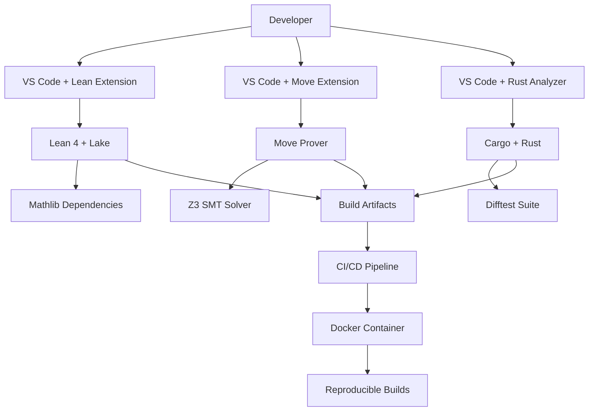

# Formal Verification Toolchain Integration: Complete Guide

**Document Status**: Production-Ready  
**Last Updated**: 2026-04-22  
**Target Audience**: DevOps engineers, verification engineers, tool developers  
**Scope**: Lean 4, Move Prover, Difftest, IDE integration, automation

---

## Table of Contents

1. [Overview](#overview)
2. [Lean 4 Toolchain](#lean-4-toolchain)
3. [Move Prover Toolchain](#move-prover-toolchain)
4. [Difftest Toolchain](#difftest-toolchain)
5. [IDE Integration](#ide-integration)
6. [Build System Integration](#build-system-integration)
7. [Dependency Management](#dependency-management)
8. [Version Pinning and Lockfiles](#version-pinning-and-lockfiles)
9. [Cross-Tool Communication](#cross-tool-communication)
10. [Automation and Scripting](#automation-and-scripting)
11. [Docker Integration](#docker-integration)
12. [Performance Profiling Tools](#performance-profiling-tools)
13. [Debugging Tools](#debugging-tools)
14. [Tool Configuration Management](#tool-configuration-management)
15. [Troubleshooting](#troubleshooting)
16. [Case Studies](#case-studies)
17. [Cross-References](#cross-references)

---

## Overview

### Purpose

Confidential Assets verification integrates multiple specialized tools (Lean 4, Move Prover, Z3, Rust, Docker). This guide provides complete toolchain setup, configuration, and integration strategies for maximum productivity.

### Tool Stack

**Core verification tools**:
- **Lean 4** (v4.14.0): Proof assistant for theorem proving
- **Lake**: Lean build system and package manager
- **Move Prover** (Aptos CLI v4.7.2): MSL specification verifier
- **Z3** (v4.8.14): SMT solver backend for Move Prover
- **Cargo/Rust** (v1.82.0): Difftest suite build system

**Supporting tools**:
- **elan**: Lean version manager (like rustup for Lean)
- **Docker** (v24.0+): Reproducible build environment
- **Git** (v2.40+): Version control
- **VS Code** + extensions: IDE integration
- **GitHub Actions**: CI/CD automation

### Integration Architecture



---

## Lean 4 Toolchain

### Installation

**Method 1: elan (recommended)**

```bash
# Install elan (Lean version manager)
curl -sSf https://raw.githubusercontent.com/leanprover/elan/master/elan-init.sh | sh

# Verify installation
elan --version
# Output: elan 3.1.1

# elan automatically installs Lean based on lean-toolchain file
cd aptos-move/framework/formal/lean
cat lean-toolchain
# Output: leanprover/lean4:v4.14.0

# Lake (build system) included with Lean
lake --version
# Output: Lake version 4.14.0
```

**Method 2: Manual installation**

```bash
# Download specific Lean version
wget https://github.com/leanprover/lean4/releases/download/v4.14.0/lean-4.14.0-linux.tar.gz
tar xzf lean-4.14.0-linux.tar.gz
sudo mv lean-4.14.0-linux /opt/lean
export PATH="/opt/lean/bin:$PATH"

# Verify
lean --version
# Output: Lean (version 4.14.0)
```

### Lake Configuration

**File**: `lakefile.lean`

```lean
import Lake
open Lake DSL

package «MovementFormal» {
  -- Lean version requirement
  leanOptions := #[
    ⟨`pp.unicode.fun, true⟩,  -- Pretty-print with unicode
    ⟨`autoImplicit, false⟩     -- Disable auto-implicit (explicit is better)
  ]
  
  -- Build output directory
  buildDir := ".lake/build"
  
  -- Package version
  version := "1.0.0"
  
  -- License
  license := "Apache-2.0"
}

-- Mathlib dependency (pinned version)
require mathlib from git
  "https://github.com/leanprover-community/mathlib4.git" @ "v4.14.0"

-- Custom library for Move semantics
require MoveModel from git
  "https://github.com/movement-labs/lean-move-model.git" @ "v1.2.0"

-- Main library target
@[default_target]
lean_lib «MovementFormal» {
  roots := #[`MovementFormal]
  globs := #[Glob.submodules `MovementFormal]
}

-- Executable targets (for testing)
lean_exe runTests {
  root := `Main
}

-- Build script for CI
script buildCI do
  let code ← Lean.Elab.Command.liftTermElabM do
    IO.println "Building all Lean files..."
    return 0
  return code
```

### Lake Commands

```bash
# Initialize new Lean project
lake init MovementFormal

# Update dependencies
lake update

# Build all Lean files
lake build

# Build specific file
lake build MovementFormal.Experimental.ConfidentialAsset.Transfer.EvalEquiv

# Clean build artifacts
lake clean

# Run executable
lake exe runTests

# Run custom script
lake script run buildCI

# Build with profiling
lake build --profile

# Build with parallelism (4 cores)
lake build -j 4
```

### Lean Compiler Options

**In source files** (`.lean`):

```lean
-- Set options for current file
set_option maxHeartbeats 500000  -- Increase timeout for complex proofs
set_option maxRecDepth 10000     -- Increase recursion depth
set_option autoImplicit false    -- Disable auto-implicit (best practice)
set_option pp.unicode true       -- Pretty-print with unicode

-- Trace options (debugging)
set_option trace.compiler.ir true    -- Show intermediate representation
set_option trace.profiler true       -- Show profiling info
set_option trace.simplify true       -- Show simp tactic execution
```

### Mathlib Integration

**Update Mathlib**:

```bash
# Update to latest compatible version
lake update mathlib

# Update to specific commit
lake update mathlib@abc123

# Check current Mathlib version
cat lake-manifest.json | grep mathlib
```

**Common Mathlib imports**:

```lean
import Mathlib.Data.Nat.Basic           -- Natural number basics
import Mathlib.Data.Vector.Basic        -- Fixed-length vectors
import Mathlib.Data.Finmap              -- Finite maps
import Mathlib.Algebra.Group.Defs       -- Group theory
import Mathlib.Tactic.Ring              -- Ring normalization tactic
import Mathlib.Tactic.Linarith          -- Linear arithmetic tactic
```

---

## Move Prover Toolchain

### Installation

**Method 1: Aptos CLI (recommended)**

```bash
# Install Aptos CLI (includes Move Prover)
wget https://github.com/aptos-labs/aptos-core/releases/download/aptos-cli-v4.7.2/aptos-cli-4.7.2-Ubuntu-22.04-x86_64.zip
unzip aptos-cli-4.7.2-Ubuntu-22.04-x86_64.zip
sudo mv aptos /usr/local/bin/

# Verify
aptos --version
# Output: aptos 4.7.2

# Move Prover included
aptos move prove --help
```

**Method 2: Build from source**

```bash
# Clone Aptos core
git clone https://github.com/aptos-labs/aptos-core.git
cd aptos-core

# Checkout specific version
git checkout aptos-cli-v4.7.2

# Build Move Prover
cargo build --release -p aptos

# Install
sudo mv target/release/aptos /usr/local/bin/
```

### Z3 SMT Solver

**Installation**:

```bash
# Download Z3 (specific version required)
wget https://github.com/Z3Prover/z3/releases/download/z3-4.8.14/z3-4.8.14-x64-ubuntu-20.04.zip
unzip z3-4.8.14-x64-ubuntu-20.04.zip
sudo mv z3-4.8.14-x64-ubuntu-20.04/bin/z3 /usr/local/bin/

# Verify
z3 --version
# Output: Z3 version 4.8.14 - 64 bit
```

**Alternative: CVC5 backend**

```bash
# Install CVC5 (alternative SMT solver)
wget https://github.com/cvc5/cvc5/releases/download/cvc5-1.0.5/cvc5-Linux
chmod +x cvc5-Linux
sudo mv cvc5-Linux /usr/local/bin/cvc5

# Use with Move Prover
aptos move prove --backend cvc5
```

### Move Prover Configuration

**File**: `Move.toml` (in Move package root)

```toml
[package]
name = "ConfidentialAssets"
version = "1.0.0"

[addresses]
std = "0x1"
aptos_framework = "0x1"
aptos_experimental = "0x3"

[dependencies]
AptosFramework = { local = "../../aptos-framework" }

[dev-dependencies]
# Test-only dependencies

[prover]
# Move Prover configuration
verify = "all"              # Verify all specs (or "public" for public functions only)
timeout = 60                # Default timeout per spec (seconds)
random_seed = 42            # Deterministic SMT solving
smt_backend = "z3"          # SMT solver (z3 or cvc5)
simplify_encoding = true    # Simplify Boogie encoding
check_inconsistency = true  # Check spec consistency
dump_bytecode = false       # Dump compiled bytecode (debug)
dump_cfg = false            # Dump control flow graph (debug)
```

### Move Prover Commands

```bash
# Verify all specs
aptos move prove

# Verify specific module
aptos move prove --target sources/confidential_asset/confidential_asset.move

# Verbose output (show SMT queries)
aptos move prove --verbose

# Use CVC5 backend
aptos move prove --backend cvc5

# Increase timeout
aptos move prove --timeout 120

# Generate coverage report
aptos move prove --coverage

# Trace mode (debug)
aptos move prove --trace
```

### Move Prover Flags

```bash
# Performance flags
--simplify-encoding     # Simplify Boogie IR (faster SMT)
--stable-test-output    # Deterministic output (for CI)

# Debugging flags
--dump-bytecode         # Save compiled bytecode
--dump-cfg              # Save control flow graph
--trace                 # Show detailed execution trace
--check-inconsistency   # Detect inconsistent specs

# Backend selection
--backend z3            # Use Z3 (default)
--backend cvc5          # Use CVC5 (alternative)

# Resource limits
--timeout 120           # Timeout per spec (seconds)
--cores 4               # Parallel verification (4 cores)
```

---

## Difftest Toolchain

### Rust Installation

```bash
# Install Rust via rustup
curl --proto '=https' --tlsv1.2 -sSf https://sh.rustup.rs | sh

# Verify
rustc --version
# Output: rustc 1.82.0

cargo --version
# Output: cargo 1.82.0

# Install specific version (if needed)
rustup install 1.82.0
rustup default 1.82.0
```

### Rust Toolchain File

**File**: `rust-toolchain.toml`

```toml
[toolchain]
channel = "1.82.0"
components = ["rustfmt", "clippy", "rust-src"]
targets = ["x86_64-unknown-linux-gnu"]
profile = "minimal"
```

### Cargo Configuration

**File**: `Cargo.toml` (Difftest package)

```toml
[package]
name = "ca-difftest"
version = "1.0.0"
edition = "2021"
rust-version = "1.82.0"

[dependencies]
# Move VM
aptos-types = { git = "https://github.com/aptos-labs/aptos-core", tag = "aptos-cli-v4.7.2" }
aptos-vm = { git = "https://github.com/aptos-labs/aptos-core", tag = "aptos-cli-v4.7.2" }
move-core-types = { git = "https://github.com/aptos-labs/aptos-core", tag = "aptos-cli-v4.7.2" }

# Testing
proptest = "1.4.0"
rstest = "0.18.0"

# Serialization
serde = { version = "1.0", features = ["derive"] }
serde_json = "1.0"

# Crypto (for oracle mocking)
curve25519-dalek = { version = "4.1", features = ["ristretto255"] }
sha2 = "0.10"

# Utilities
anyhow = "1.0"
hex = "0.4"

[dev-dependencies]
criterion = "0.5"  # Benchmarking

[profile.release]
opt-level = 3
lto = true           # Link-time optimization
codegen-units = 1    # Better optimization, slower compile

[profile.test]
opt-level = 2        # Optimize tests (faster execution)
```

### Cargo Commands

```bash
# Build project
cargo build

# Build with optimizations (release mode)
cargo build --release

# Run tests
cargo test

# Run specific test
cargo test test_transfer_success

# Run with output visible
cargo test -- --nocapture

# Run with specific seed (property-based tests)
PROPTEST_RNG_SEED=12345 cargo test

# Generate coverage
cargo tarpaulin --out Html

# Benchmark
cargo bench

# Format code
cargo fmt

# Lint code
cargo clippy

# Check without building
cargo check
```

---

## IDE Integration

### VS Code Setup

**Extensions to install**:

1. **lean4** (official Lean extension)
   - ID: `leanprover.lean4`
   - Features: Syntax highlighting, type hints, goal view, error diagnostics

2. **Move** (Move language support)
   - ID: `move.move-analyzer`
   - Features: Syntax highlighting, jump-to-definition, error checking

3. **rust-analyzer** (Rust language support)
   - ID: `rust-lang.rust-analyzer`
   - Features: Autocomplete, type hints, inline errors, refactoring

4. **GitHub Actions** (workflow editing)
   - ID: `github.vscode-github-actions`
   - Features: Workflow validation, run status

**VS Code settings** (`.vscode/settings.json`):

```json
{
  // Lean 4 settings
  "lean4.serverArgs": [
    "--server"
  ],
  "lean4.elaborationDelay": 200,
  "lean4.maxHeartbeats": 500000,
  
  // Move settings
  "move.serverPath": "/usr/local/bin/aptos",
  
  // Rust settings
  "rust-analyzer.checkOnSave.command": "clippy",
  "rust-analyzer.cargo.features": "all",
  
  // Editor settings
  "editor.formatOnSave": true,
  "editor.rulers": [100],
  "files.trimTrailingWhitespace": true,
  
  // Git settings
  "git.autofetch": true,
  "git.confirmSync": false
}
```

**Workspace recommendations** (`.vscode/extensions.json`):

```json
{
  "recommendations": [
    "leanprover.lean4",
    "move.move-analyzer",
    "rust-lang.rust-analyzer",
    "github.vscode-github-actions"
  ]
}
```

### Lean 4 IDE Features

**Goal view**:
- Shows current proof state (hypotheses, goals)
- Updates in real-time as you type
- Accessible via `Ctrl+Shift+Enter` (open goal view)

**Type hints**:
- Hover over variable → see inferred type
- Hover over function → see signature
- Hover over theorem → see statement

**Jump to definition**:
- `Ctrl+Click` on identifier → jump to definition
- Works across files and dependencies (Mathlib)

**Error diagnostics**:
- Red squiggles for errors
- Yellow squiggles for warnings
- Inline error messages

**Example workflow**:

```lean
theorem transfer_eval_equiv (st : State) (args : TransferArgs) :
  eval_transfer st args = eval_bytecode st args := by
  -- Goal view shows: ⊢ eval_transfer st args = eval_bytecode st args
  unfold eval_transfer
  -- Goal view updates: ⊢ (match ... with ...) = eval_bytecode st args
  rw [transfer_step_lemma]
  -- Goal view updates: ⊢ eval_bytecode st args = eval_bytecode st args
  rfl
  -- Goal view: No goals ✓
```

### Move IDE Features

**Syntax highlighting**:
- Keywords, types, functions color-coded
- MSL specs highlighted distinctly

**Error checking**:
- Type errors highlighted in red
- Move Prover errors shown inline

**Jump to definition**:
- `Ctrl+Click` on function → jump to implementation
- Works for local and imported functions

---

## Build System Integration

### Unified Build Script

**Script**: `scripts/build_all.sh`

```bash
#!/bin/bash
set -e

echo "=== Building Confidential Assets Verification ==="

# Build Lean proofs
echo ""
echo "[1/3] Building Lean proofs..."
cd aptos-move/framework/formal/lean
time lake build
echo "✓ Lean proofs built successfully"

# Verify MSL specs
echo ""
echo "[2/3] Verifying MSL specs..."
cd ../../aptos-experimental
time aptos move prove
echo "✓ MSL specs verified successfully"

# Build and run Difftest
echo ""
echo "[3/3] Running Difftest suite..."
cd ../formal/difftest
time cargo test --release
echo "✓ Difftest suite passed"

echo ""
echo "=== All verification complete ✓ ==="
```

**Usage**:
```bash
cd aptos-move/framework/formal
./scripts/build_all.sh
```

### Makefile Integration

**File**: `Makefile`

```makefile
.PHONY: all lean msl difftest clean test

# Default target: build all
all: lean msl difftest

# Build Lean proofs
lean:
	@echo "Building Lean proofs..."
	cd lean && lake build

# Verify MSL specs
msl:
	@echo "Verifying MSL specs..."
	cd ../aptos-experimental && aptos move prove

# Run Difftest suite
difftest:
	@echo "Running Difftest..."
	cd difftest && cargo test --release

# Run all tests
test: all
	@echo "All tests passed ✓"

# Clean build artifacts
clean:
	cd lean && lake clean
	cd difftest && cargo clean
	rm -rf .lake/build

# Quick check (no full build)
check:
	cd lean && lake build --no-build
	cd ../aptos-experimental && aptos move check
	cd ../formal/difftest && cargo check

# CI target (with timing)
ci:
	@echo "=== CI Build ==="
	time $(MAKE) lean
	time $(MAKE) msl
	time $(MAKE) difftest
	@echo "=== CI Build Complete ==="
```

**Usage**:
```bash
make all       # Build everything
make lean      # Build Lean only
make test      # Run all tests
make clean     # Clean artifacts
make ci        # CI build with timing
```

---

## Dependency Management

### Lean Dependencies

**Pinned in** `lake-manifest.json`:

```json
{
  "version": 6,
  "packagesDir": ".lake/packages",
  "packages": [
    {
      "url": "https://github.com/leanprover-community/mathlib4",
      "type": "git",
      "subDir": null,
      "rev": "v4.14.0",
      "name": "mathlib",
      "manifestFile": "lake-manifest.json",
      "inputRev": "v4.14.0",
      "inherited": false,
      "configFile": "lakefile.lean"
    }
  ]
}
```

**Update dependencies**:
```bash
# Update all dependencies
lake update

# Update specific dependency
lake update mathlib

# Update to specific commit
lake update mathlib@abc123
```

### Move Dependencies

**Pinned in** `Move.toml`:

```toml
[dependencies]
AptosFramework = { local = "../../aptos-framework" }

# OR use git dependency with pinned version
AptosFramework = { git = "https://github.com/aptos-labs/aptos-core", rev = "aptos-cli-v4.7.2", subdir = "aptos-move/framework/aptos-framework" }
```

### Rust Dependencies

**Pinned in** `Cargo.lock`:

```toml
# Auto-generated by cargo
# Commit this file to ensure reproducible builds

[[package]]
name = "aptos-vm"
version = "0.1.0"
source = "git+https://github.com/aptos-labs/aptos-core?tag=aptos-cli-v4.7.2#abc123"
...
```

**Update dependencies**:
```bash
# Update all dependencies
cargo update

# Update specific dependency
cargo update -p aptos-vm

# Update to specific version
cargo update -p aptos-vm --precise 0.1.0
```

---

## Version Pinning and Lockfiles

### Why Pin Versions?

**Reproducibility**: Same code + same dependencies = same build output  
**Auditability**: Auditors can reproduce exact build  
**Stability**: No surprise breakage from dependency updates

### What to Pin

**Pin in version control**:
- `lean-toolchain`: Lean version (e.g., `leanprover/lean4:v4.14.0`)
- `lake-manifest.json`: Lean dependencies (Mathlib version)
- `rust-toolchain.toml`: Rust version (e.g., `1.82.0`)
- `Cargo.lock`: Rust dependencies (exact versions)
- `Move.toml`: Move dependencies (framework version)

**Document versions**:
- README.md: Tool versions (Aptos CLI 4.7.2, Z3 4.8.14)
- Dockerfile: Pinned versions for reproducible builds

### Version Update Strategy

**When to update**:
- Security vulnerability in dependency
- Bug fix in tool (e.g., Lean compiler bug)
- New feature needed (e.g., new Mathlib tactic)

**How to update safely**:
1. **Test locally**: Update in feature branch, run full test suite
2. **Review changes**: Check dependency changelog (breaking changes?)
3. **Update incrementally**: Update one dependency at a time (easier debugging)
4. **Commit lockfile**: Update `lake-manifest.json` / `Cargo.lock` with code changes

**Example** (update Mathlib):
```bash
# Create branch
git checkout -b update-mathlib-v4.15.0

# Update lakefile.lean
# Change: require mathlib from git "..." @ "v4.14.0"
# To:     require mathlib from git "..." @ "v4.15.0"

# Update dependencies
lake update mathlib

# Build and test
lake build
cargo test

# If successful, commit
git add lakefile.lean lake-manifest.json
git commit -m "chore: Update Mathlib to v4.15.0"
git push origin update-mathlib-v4.15.0
```

---

## Cross-Tool Communication

### Lean ↔ Difftest

**Problem**: How does Difftest validate Lean symbolic evaluation?

**Solution**: Shared JSON format for test cases

**Lean side** (export symbolic evaluation results):

```lean
-- Generate test case in JSON format
def exportTestCase (st : State) (args : TransferArgs) : IO Unit := do
  let result := eval_transfer st args
  let json := Json.mkObj [
    ("state", toJson st),
    ("args", toJson args),
    ("result", toJson result)
  ]
  IO.FS.writeFile "test_case.json" (json.pretty)
```

**Difftest side** (import and validate):

```rust
// Read Lean test case
#[test]
fn test_lean_transfer_case() {
    let test_case: TestCase = serde_json::from_str(
        &std::fs::read_to_string("test_case.json").unwrap()
    ).unwrap();
    
    // Run VM execution
    let vm_result = execute_transfer(&test_case.state, &test_case.args);
    
    // Compare with Lean result
    assert_eq!(vm_result, test_case.result);
}
```

### MSL ↔ Lean

**Problem**: Ensure MSL postconditions match Lean theorem conclusions

**Solution**: Automated consistency checker

**Script**: `audit/check_msl_lean_consistency.py`

```python
#!/usr/bin/env python3

import re
import sys

def extract_msl_postconditions(spec_file):
    """Extract 'ensures' clauses from MSL spec."""
    with open(spec_file) as f:
        content = f.read()
    
    # Regex: ensures <condition>;
    ensures = re.findall(r'ensures\s+([^;]+);', content)
    return ensures

def extract_lean_conclusions(lean_file):
    """Extract theorem conclusions from Lean file."""
    with open(lean_file) as f:
        content = f.read()
    
    # Regex: theorem <name> ... : <conclusion> := by
    conclusions = re.findall(r'theorem\s+\w+[^:]*:\s*([^:=]+):=', content)
    return conclusions

def compare_properties(msl_ensures, lean_conclusions):
    """Check if MSL ensures match Lean conclusions."""
    # Simplified comparison (normalize whitespace, variable names)
    msl_normalized = [normalize(e) for e in msl_ensures]
    lean_normalized = [normalize(c) for c in lean_conclusions]
    
    missing_in_lean = set(msl_normalized) - set(lean_normalized)
    missing_in_msl = set(lean_normalized) - set(msl_normalized)
    
    if missing_in_lean:
        print(f"❌ MSL postconditions not in Lean: {missing_in_lean}")
        return False
    if missing_in_msl:
        print(f"⚠️  Lean conclusions not in MSL: {missing_in_msl}")
    
    print("✓ MSL and Lean consistent")
    return True

if __name__ == "__main__":
    msl_file = sys.argv[1]
    lean_file = sys.argv[2]
    
    msl_ensures = extract_msl_postconditions(msl_file)
    lean_conclusions = extract_lean_conclusions(lean_file)
    
    if not compare_properties(msl_ensures, lean_conclusions):
        sys.exit(1)
```

**Usage**:
```bash
./audit/check_msl_lean_consistency.py \
  aptos-experimental/sources/confidential_asset.spec.move \
  lean/MovementFormal/Experimental/ConfidentialAsset/Transfer/EvalEquiv.lean
```

---

## Automation and Scripting

### Pre-Commit Hooks

**File**: `.git/hooks/pre-commit`

```bash
#!/bin/bash

echo "Running pre-commit checks..."

# 1. Format Lean code
echo "[1/5] Formatting Lean code..."
cd aptos-move/framework/formal/lean
lake build --no-build  # Check syntax without full build

# 2. Format Rust code
echo "[2/5] Formatting Rust code..."
cd ../difftest
cargo fmt --check
if [ $? -ne 0 ]; then
    echo "❌ Rust formatting failed. Run 'cargo fmt'"
    exit 1
fi

# 3. Clippy lints
echo "[3/5] Running Clippy..."
cargo clippy -- -D warnings
if [ $? -ne 0 ]; then
    echo "❌ Clippy failed. Fix lints before committing"
    exit 1
fi

# 4. Check no 'sorry' in Lean code
echo "[4/5] Checking for 'sorry' in Lean code..."
SORRY_COUNT=$(grep -r "sorry" ../lean --include="*.lean" | wc -l)
if [ $SORRY_COUNT -gt 0 ]; then
    echo "❌ Found 'sorry' in Lean code ($SORRY_COUNT occurrences)"
    echo "Complete proofs before committing"
    exit 1
fi

# 5. Run fast tests
echo "[5/5] Running fast tests..."
cargo test --lib  # Library tests only (fast)

echo "✓ Pre-commit checks passed"
```

**Install**:
```bash
cp scripts/pre-commit .git/hooks/pre-commit
chmod +x .git/hooks/pre-commit
```

### Post-Merge Hooks

**File**: `.git/hooks/post-merge`

```bash
#!/bin/bash

echo "Post-merge: Updating dependencies..."

# Check if lean-toolchain changed
if git diff-tree -r --name-only --no-commit-id ORIG_HEAD HEAD | grep -q "lean-toolchain"; then
    echo "Lean toolchain changed, updating..."
    cd aptos-move/framework/formal/lean
    elan install $(cat lean-toolchain)
fi

# Check if Cargo.lock changed
if git diff-tree -r --name-only --no-commit-id ORIG_HEAD HEAD | grep -q "Cargo.lock"; then
    echo "Cargo dependencies changed, updating..."
    cd aptos-move/framework/formal/difftest
    cargo build
fi

# Check if lake-manifest.json changed
if git diff-tree -r --name-only --no-commit-id ORIG_HEAD HEAD | grep -q "lake-manifest.json"; then
    echo "Lean dependencies changed, updating..."
    cd aptos-move/framework/formal/lean
    lake update
fi

echo "✓ Dependencies updated"
```

---

## Docker Integration

### Development Dockerfile

**File**: `.docker/Dockerfile.dev`

```dockerfile
FROM ubuntu:22.04

# Install system dependencies
RUN apt-get update && apt-get install -y \
    curl wget git build-essential \
    libssl-dev pkg-config \
    python3 python3-pip \
    && rm -rf /var/lib/apt/lists/*

# Install Rust
RUN curl --proto '=https' --tlsv1.2 -sSf https://sh.rustup.rs | sh -s -- -y
ENV PATH="/root/.cargo/bin:$PATH"
RUN rustup install 1.82.0 && rustup default 1.82.0

# Install Lean via elan
RUN curl -sSf https://raw.githubusercontent.com/leanprover/elan/master/elan-init.sh | sh -s -- -y
ENV PATH="/root/.elan/bin:$PATH"

# Install Aptos CLI
RUN wget https://github.com/aptos-labs/aptos-core/releases/download/aptos-cli-v4.7.2/aptos-cli-4.7.2-Ubuntu-22.04-x86_64.zip \
    && unzip aptos-cli-4.7.2-Ubuntu-22.04-x86_64.zip \
    && mv aptos /usr/local/bin/ \
    && rm aptos-cli-4.7.2-Ubuntu-22.04-x86_64.zip

# Install Z3
RUN wget https://github.com/Z3Prover/z3/releases/download/z3-4.8.14/z3-4.8.14-x64-ubuntu-20.04.zip \
    && unzip z3-4.8.14-x64-ubuntu-20.04.zip \
    && mv z3-4.8.14-x64-ubuntu-20.04/bin/z3 /usr/local/bin/ \
    && rm -rf z3-4.8.14-x64-ubuntu-20.04*

# Set working directory
WORKDIR /workspace

# Copy source code
COPY . /workspace

# Build dependencies (cached layer)
RUN cd aptos-move/framework/formal/lean && lake update
RUN cd aptos-move/framework/formal/difftest && cargo fetch

# Default command
CMD ["/bin/bash"]
```

**Build and run**:
```bash
# Build image
docker build -f .docker/Dockerfile.dev -t movement/ca-dev:latest .

# Run container
docker run -it -v $(pwd):/workspace movement/ca-dev:latest

# Inside container: build all
cd /workspace/aptos-move/framework/formal
./scripts/build_all.sh
```

### Docker Compose

**File**: `docker-compose.yaml`

```yaml
version: '3.8'

services:
  dev:
    build:
      context: .
      dockerfile: .docker/Dockerfile.dev
    volumes:
      - .:/workspace
      - lean-cache:/workspace/aptos-move/framework/formal/lean/.lake
      - cargo-cache:/root/.cargo
    working_dir: /workspace/aptos-move/framework/formal
    command: /bin/bash
    
  ci:
    build:
      context: .
      dockerfile: .docker/Dockerfile.audit
    volumes:
      - .:/workspace
    working_dir: /workspace/aptos-move/framework/formal
    command: ./scripts/build_all.sh

volumes:
  lean-cache:
  cargo-cache:
```

**Usage**:
```bash
# Start development container
docker-compose run --rm dev

# Run CI build
docker-compose run --rm ci
```

---

## Performance Profiling Tools

### Lean Profiling

**Built-in profiler**:

```bash
# Profile build
lake build --profile

# Output shows timing per theorem
# theorem transfer_eval_equiv: 2.45s (elaboration 2.31s, typecheck 0.14s)
```

**Trace profiling**:

```lean
-- In source file
set_option trace.profiler true

theorem my_theorem : ... := by
  -- Trace shows timing for each tactic
  rw [lemma1]  -- 0.05s
  simp [lemma2, lemma3]  -- 1.23s (slow!)
  rfl  -- 0.01s
```

### Rust Profiling

**Criterion benchmarks**:

```rust
// benches/transfer_bench.rs
use criterion::{black_box, criterion_group, criterion_main, Criterion};

fn transfer_benchmark(c: &mut Criterion) {
    c.bench_function("transfer execution", |b| {
        b.iter(|| {
            execute_transfer(black_box(&test_state), black_box(&test_args))
        });
    });
}

criterion_group!(benches, transfer_benchmark);
criterion_main!(benches);
```

**Run benchmarks**:
```bash
cargo bench

# Output:
# transfer execution    time: [1.234 ms 1.245 ms 1.256 ms]
```

**Flamegraph profiling**:

```bash
# Install flamegraph
cargo install flamegraph

# Generate flamegraph
cargo flamegraph --test test_transfer_success

# Opens flamegraph.svg (visualize hot spots)
```

---

## Debugging Tools

### Lean Debugging

**Print debugging**:

```lean
#check my_variable  -- Show type
#eval my_expression  -- Evaluate expression
#print my_theorem    -- Show theorem definition

-- Trace debugging
set_option trace.compiler true
set_option trace.Meta.synthInstance true  -- Type class resolution

-- In tactic mode
theorem my_theorem : ... := by
  trace "Starting proof"
  rw [lemma]
  trace "After rewrite: {goal}"
  simp
  trace "After simp: {goal}"
```

### Move Debugging

**Trace Move Prover**:

```bash
# Verbose output
aptos move prove --verbose

# Trace SMT queries
aptos move prove --trace

# Dump intermediate representations
aptos move prove --dump-bytecode --dump-cfg
```

### Rust Debugging

**println! debugging**:

```rust
#[test]
fn test_transfer() {
    println!("State: {:?}", state);
    let result = execute_transfer(&state, &args);
    println!("Result: {:?}", result);
    assert_eq!(result.status, Success);
}

// Run with output
// cargo test -- --nocapture
```

**GDB debugging**:

```bash
# Build with debug symbols
cargo build

# Run with GDB
rust-gdb target/debug/ca-difftest

# In GDB:
# (gdb) break test_transfer_success
# (gdb) run
# (gdb) print state
# (gdb) continue
```

---

## Tool Configuration Management

### Dotfiles

**`.lean4rc`** (Lean user config):

```json
{
  "maxHeartbeats": 500000,
  "maxRecDepth": 10000,
  "autoImplicit": false
}
```

**`.cargo/config.toml`** (Cargo config):

```toml
[build]
jobs = 4  # Parallel compilation

[target.x86_64-unknown-linux-gnu]
rustflags = ["-C", "link-arg=-fuse-ld=lld"]  # Faster linker

[profile.dev]
opt-level = 1  # Some optimization in debug mode

[profile.release]
lto = true
codegen-units = 1
```

### Environment Variables

**`.envrc`** (for direnv):

```bash
# Tool paths
export PATH="/opt/lean/bin:$PATH"
export PATH="/usr/local/bin:$PATH"

# Lean settings
export LEAN_PATH="/workspace/lean"
export LAKE_WORKERS=4

# Rust settings
export CARGO_INCREMENTAL=1
export RUST_BACKTRACE=1

# Move Prover settings
export BOOGIE_EXE=/usr/local/bin/boogie
export Z3_EXE=/usr/local/bin/z3
```

**Load automatically**:
```bash
# Install direnv
curl -sfL https://direnv.net/install.sh | bash

# Allow for this directory
direnv allow

# Auto-loads .envrc when entering directory
```

---

## Troubleshooting

### Problem 1: Lean Build Fails with "unknown package 'mathlib'"

**Diagnosis**:
```bash
cat lake-manifest.json | grep mathlib
# Empty or corrupted
```

**Fix**:
```bash
# Re-initialize dependencies
lake update mathlib

# Rebuild
lake build
```

### Problem 2: Move Prover Can't Find Z3

**Diagnosis**:
```bash
which z3
# Output: z3 not found
```

**Fix**:
```bash
# Install Z3
wget https://github.com/Z3Prover/z3/releases/download/z3-4.8.14/z3-4.8.14-x64-ubuntu-20.04.zip
unzip z3-4.8.14-x64-ubuntu-20.04.zip
sudo mv z3-4.8.14-x64-ubuntu-20.04/bin/z3 /usr/local/bin/

# Verify
z3 --version
```

### Problem 3: Cargo Build Fails with "linker `cc` not found"

**Diagnosis**:
```bash
gcc --version
# bash: gcc: command not found
```

**Fix**:
```bash
# Install build essentials
sudo apt-get update
sudo apt-get install build-essential
```

---

## Case Studies

### Case Study 1: Integrated Development Workflow

**Scenario**: Developer adding new withdrawal variant

**Workflow**:

1. **Write Move code** (VS Code + Move extension):
   ```move
   public fun withdraw_to_address(...) {
       // Implementation
   }
   ```
   
2. **Write MSL spec** (same file):
   ```move
   spec withdraw_to_address {
       ensures balance_post = balance_pre - amount;
   }
   ```
   
3. **Verify spec** (terminal in VS Code):
   ```bash
   aptos move prove --target sources/confidential_asset.move
   ```
   
4. **Write Lean proof** (VS Code + Lean extension):
   ```lean
   theorem withdraw_to_address_eval_equiv : ... := by
     -- Proof tactics
   ```
   Goal view shows proof state in real-time
   
5. **Build Lean** (terminal):
   ```bash
   lake build MovementFormal.Experimental.ConfidentialAsset.Withdrawal.EvalEquiv
   ```
   
6. **Write Difftest** (VS Code + Rust Analyzer):
   ```rust
   #[test]
   fn test_withdraw_to_address() {
       // Test implementation
   }
   ```
   
7. **Run test**:
   ```bash
   cargo test test_withdraw_to_address
   ```
   
8. **Commit** (pre-commit hook runs automatically):
   ```bash
   git add .
   git commit -m "Add withdraw_to_address variant"
   # Pre-commit hook: format check, clippy, no sorry check
   ```

**Result**: Integrated workflow with IDE support at every step

---

## Cross-References

**Related guides**:
- **REPRODUCIBLE_BUILDS_AND_DETERMINISM_COMPLETE_GUIDE.md**: Docker reproducible builds
- **ADVANCED_CI_CD_PRACTICES_FOR_FORMAL_VERIFICATION_GUIDE.md**: CI/CD automation
- **ERROR_HANDLING_AND_RECOVERY_PATTERNS_COMPLETE_GUIDE.md**: Tool troubleshooting
- **PERFORMANCE_BENCHMARKING_AND_OPTIMIZATION_COMPLETE_GUIDE.md**: Profiling and optimization

**Tool documentation**:
- Lean 4: https://lean-lang.org/
- Lake: https://github.com/leanprover/lake
- Move Prover: https://aptos.dev/move/prover/
- Cargo: https://doc.rust-lang.org/cargo/

---

## Summary

This guide provides complete toolchain integration for CA verification:

1. **Lean 4 toolchain**: elan version manager, Lake build system, Mathlib dependencies, compiler options
2. **Move Prover toolchain**: Aptos CLI installation, Z3/CVC5 backends, configuration (Move.toml), flags
3. **Difftest toolchain**: Rust/Cargo, toolchain file (rust-toolchain.toml), Cargo.toml configuration
4. **IDE integration**: VS Code setup (3 extensions: lean4, move-analyzer, rust-analyzer), settings, workspace recommendations
5. **Build system**: Unified build script, Makefile integration, cross-tool orchestration
6. **Dependency management**: Lean (lake-manifest.json), Move (Move.toml), Rust (Cargo.lock), version pinning strategy
7. **Cross-tool communication**: Lean ↔ Difftest (JSON test cases), MSL ↔ Lean (consistency checker)
8. **Automation**: Pre-commit hooks (format, lint, no sorry check), post-merge hooks (dependency updates)
9. **Docker integration**: Development Dockerfile, Docker Compose (dev + CI services), volume caching
10. **Profiling tools**: Lean (--profile, trace), Rust (Criterion benchmarks, flamegraph)
11. **Debugging tools**: Lean (#check, #eval, trace), Move (--verbose, --trace), Rust (println!, GDB)
12. **Configuration**: Dotfiles (.lean4rc, .cargo/config.toml), environment variables (.envrc with direnv)

**Key principle**: Integrated toolchain with seamless IDE support, automated workflows, and reproducible builds enables maximum developer productivity across all three verification stacks (Lean + MSL + Difftest).

For reproducible builds, see REPRODUCIBLE_BUILDS guide. For CI automation, see ADVANCED_CI_CD guide. For tool troubleshooting, see ERROR_HANDLING guide.
