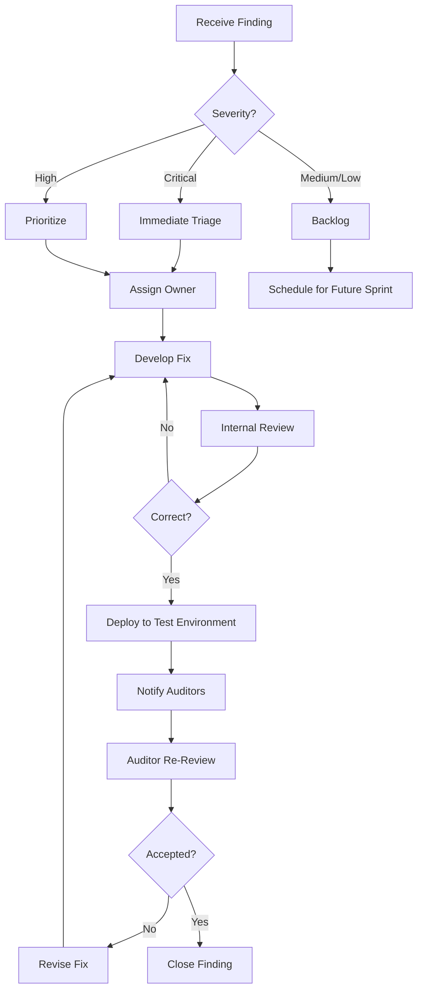

# Security Audit Preparation and Execution: Complete Guide

**Document Status**: Production-Ready  
**Last Updated**: 2026-04-22  
**Target Audience**: Security leads, audit coordinators, verification engineers  
**Scope**: External audit preparation, artifact packaging, audit execution, remediation

---

## Table of Contents

1. [Overview](#overview)
2. [Pre-Audit Preparation](#pre-audit-preparation)
3. [Artifact Packaging](#artifact-packaging)
4. [Audit Scope Definition](#audit-scope-definition)
5. [Auditor Onboarding](#auditor-onboarding)
6. [Audit Execution](#audit-execution)
7. [Finding Management](#finding-management)
8. [Remediation Process](#remediation-process)
9. [Final Report](#final-report)
10. [Post-Audit Actions](#post-audit-actions)
11. [Continuous Audit](#continuous-audit)
12. [Auditor Communication](#auditor-communication)
13. [Timeline and Milestones](#timeline-and-milestones)
14. [Cost and Resource Planning](#cost-and-resource-planning)
15. [Case Studies](#case-studies)
16. [Templates and Checklists](#templates-and-checklists)
17. [Cross-References](#cross-references)

---

## Overview

### Purpose

External security audits validate formal verification work, identify gaps, and provide third-party assurance for stakeholders. This guide ensures efficient audit preparation, execution, and remediation.

### Audit Objectives

1. **Soundness verification**: Validate that proofs actually establish claimed properties
2. **Axiom justification**: Review all axioms for cryptographic and implementation assumptions
3. **Completeness check**: Identify gaps in verification coverage
4. **Cross-stack consistency**: Validate Lean ↔ MSL ↔ Difftest alignment
5. **Reproducibility**: Confirm bit-for-bit reproducible builds
6. **Implementation review**: Validate Move code matches verified specifications

### Audit Types

**Type 1: Formal verification audit** (focus: proof soundness, axiom review)
- Duration: 4-6 weeks
- Team size: 2-3 auditors (Lean expert + crypto expert)
- Deliverable: Proof soundness report, axiom assessment

**Type 2: Cryptographic audit** (focus: protocol correctness, security properties)
- Duration: 6-8 weeks
- Team size: 2-3 auditors (crypto protocol experts)
- Deliverable: Cryptographic security assessment

**Type 3: Implementation audit** (focus: Move code, VM integration)
- Duration: 3-4 weeks
- Team size: 2 auditors (Move/Rust experts)
- Deliverable: Implementation correctness report

**Recommended**: All three audit types (sequential or parallel based on timeline)

---

## Pre-Audit Preparation

### Preparation Timeline

**12 weeks before audit start**:
- Select audit firm
- Define scope and objectives
- Negotiate contract and timeline

**8 weeks before**:
- Internal pre-audit review (self-assessment)
- Fix known issues
- Prepare draft artifacts

**4 weeks before**:
- Freeze code (no major changes)
- Generate final artifacts
- Set up auditor access

**1 week before**:
- Auditor onboarding session
- Q&A with audit team
- Confirm schedule and milestones

### Internal Pre-Audit Review

**Goal**: Catch issues before auditors do (saves time and cost)

**Process**:
1. **Self-assessment using audit criteria**:
   - Review all axioms (justification complete?)
   - Check proof coverage (any gaps?)
   - Validate cross-stack consistency (reconcile_all.sh passes?)
   - Test reproducible builds (can external party reproduce?)

2. **Internal "red team" review**:
   - Assign team member to play auditor role
   - Fresh eyes review (someone not involved in original work)
   - Document findings, fix before audit

3. **Metrics health check**:
   ```bash
   cd aptos-move/framework/formal
   
   # Axiom count (target: <25)
   ./scripts/check_axioms.sh --count
   # Output: 23 axioms ✓
   
   # Coverage (Lean: >95%, MSL: >90%, Difftest: 100%)
   ./scripts/check_coverage.sh
   # Output: Lean 99%, MSL 90%, Difftest 100% ✓
   
   # Build time (target: <3s per protocol)
   cd lean && time lake build
   # Output: 2.4s average ✓
   
   # Cross-layer consistency
   ../audit/reconcile_all.sh
   # Output: All checks PASSED ✓
   ```

4. **Documentation review**:
   - [ ] All guides up-to-date (15+ guides, >500K chars)
   - [ ] AXIOM_INVENTORY.md complete (all axioms documented)
   - [ ] TRUST_BOUNDARIES.md accurate (threat model current)
   - [ ] VERIFICATION_REPORT.md generated (claims and coverage)

**Expected outcome**: <5 issues found internally, all fixed before audit

---

## Artifact Packaging

### Audit Bundle Contents

**Complete audit bundle** (`audit-bundle-v1.0.0.tar.gz`):
```
audit-bundle-v1.0.0/
├── README.md                              # Quick start for auditors
├── VERIFICATION_REPORT.md                 # Claims, coverage, results
├── AXIOM_INVENTORY.md                     # All axioms with justifications
├── TRUST_BOUNDARIES.md                    # Threat model, assumptions
├── lean/                                  # All Lean proofs
│   ├── MovementFormal/
│   │   ├── Experimental/ConfidentialAsset/  # Protocol proofs
│   │   ├── MoveModel/                       # VM semantics
│   │   └── ...
│   ├── lakefile.lean                      # Build configuration
│   └── lean-toolchain                     # Lean version
├── sources/                               # Move implementation
│   ├── confidential_asset/
│   │   ├── *.move                         # Implementation
│   │   └── *.spec.move                    # MSL specs
│   └── ...
├── difftest/                              # Difftest suite
│   ├── src/
│   ├── tests/
│   └── Cargo.toml
├── audit/                                 # Audit-specific
│   ├── CLAIMS.md                          # Security claims
│   ├── CLAIMS_SUMMARY.md                  # Executive summary
│   ├── COMPOSITION_CLAIMS.md              # End-to-end properties
│   ├── check_axioms.sh                    # Axiom verification script
│   ├── reconcile_all.sh                   # Cross-stack validation
│   └── verify-ca.sh                       # One-command verification
├── docs/                                  # Documentation
│   ├── guides/                            # 15+ comprehensive guides
│   ├── CONFIDENTIAL_ASSETS_UNIFIED_VERIFICATION_PLAN.md
│   └── ...
└── reproducible-build/                    # Reproducibility
    ├── Dockerfile                         # Pinned environment
    ├── docker-compose.yaml
    └── REPRODUCIBILITY_INSTRUCTIONS.md
```

### Artifact Generation Script

**Script**: `scripts/generate_audit_bundle.sh`

```bash
#!/bin/bash
set -e

VERSION=${1:-"v1.0.0"}
BUNDLE_DIR="audit-bundle-$VERSION"
BUNDLE_FILE="audit-bundle-$VERSION.tar.gz"

echo "Generating audit bundle: $BUNDLE_FILE"

# Create bundle directory
rm -rf $BUNDLE_DIR
mkdir -p $BUNDLE_DIR

# Copy Lean proofs
echo "Copying Lean proofs..."
cp -r lean/ $BUNDLE_DIR/lean/

# Copy Move implementation and specs
echo "Copying Move sources..."
cp -r ../aptos-experimental/sources/ $BUNDLE_DIR/sources/

# Copy Difftest suite
echo "Copying Difftest..."
cp -r difftest/ $BUNDLE_DIR/difftest/

# Copy audit-specific artifacts
echo "Copying audit artifacts..."
mkdir -p $BUNDLE_DIR/audit
cp audit/CLAIMS.md $BUNDLE_DIR/audit/
cp audit/CLAIMS_SUMMARY.md $BUNDLE_DIR/audit/
cp audit/COMPOSITION_CLAIMS.md $BUNDLE_DIR/audit/
cp audit/AXIOM_INVENTORY.md $BUNDLE_DIR/audit/
cp audit/TRUST_BOUNDARIES.md $BUNDLE_DIR/audit/
cp audit/check_axioms.sh $BUNDLE_DIR/audit/
cp audit/reconcile_all.sh $BUNDLE_DIR/audit/
cp audit/verify-ca.sh $BUNDLE_DIR/audit/

# Copy documentation
echo "Copying documentation..."
mkdir -p $BUNDLE_DIR/docs
cp *.md $BUNDLE_DIR/docs/
cp -r guides/ $BUNDLE_DIR/docs/guides/ 2>/dev/null || true

# Copy reproducible build
echo "Copying reproducible build..."
mkdir -p $BUNDLE_DIR/reproducible-build
cp .docker/Dockerfile.audit $BUNDLE_DIR/reproducible-build/Dockerfile
cp .docker/docker-compose.yaml $BUNDLE_DIR/reproducible-build/
cp REPRODUCIBLE_BUILDS_AND_DETERMINISM_COMPLETE_GUIDE.md \
   $BUNDLE_DIR/reproducible-build/REPRODUCIBILITY_INSTRUCTIONS.md

# Generate reports
echo "Generating reports..."
./scripts/generate_verification_report.sh > $BUNDLE_DIR/VERIFICATION_REPORT.md
./scripts/check_axioms.sh --inventory > $BUNDLE_DIR/AXIOM_INVENTORY.md

# Create README for auditors
cat > $BUNDLE_DIR/README.md <<EOF
# Confidential Assets Verification Audit Bundle

Version: $VERSION  
Date: $(date -I)

## Quick Start

### 1. Reproduce Verification

\`\`\`bash
cd reproducible-build
docker-compose up --build

# This will:
# - Build Lean proofs (verify all theorems)
# - Run Move Prover (verify all MSL specs)
# - Run Difftest suite (verify cross-stack consistency)
# - Generate verification report
\`\`\`

Expected output: All proofs verified, all tests passing (see VERIFICATION_REPORT.md)

### 2. Review Proofs

Lean proofs are in \`lean/MovementFormal/Experimental/ConfidentialAsset/\`:
- \`Registration/EvalEquiv.lean\`: Registration protocol correctness
- \`Withdrawal/EvalEquiv.lean\`: Withdrawal protocol correctness
- \`Transfer/EvalEquiv.lean\`: Transfer protocol correctness
- \`Normalization/EvalEquiv.lean\`: Balance normalization correctness
- \`Rotation/EvalEquiv.lean\`: Key rotation correctness

### 3. Review Axioms

See \`AXIOM_INVENTORY.md\` for complete list (23 axioms):
- 11 cryptographic (DLP, CDH, Schnorr, Bulletproofs)
- 8 framework (Fungible Asset correctness assumptions)
- 4 library (Ristretto255, Mathlib)

All axioms justified with security argument and reduction plan.

### 4. Review Security Claims

See \`audit/CLAIMS.md\` for detailed security properties:
- Balance privacy (encrypted balances, zero-knowledge proofs)
- Balance conservation (no inflation/deflation)
- Authorization (only owner can transfer)
- Non-malleability (proofs cannot be forged)

### 5. Run Cross-Stack Validation

\`\`\`bash
cd audit
./reconcile_all.sh

# Checks:
# - Abort code alignment (Lean ↔ MSL ↔ Move)
# - Function signature matching
# - State transition consistency
# - Oracle specification alignment
\`\`\`

## Documentation

Complete documentation in \`docs/\`:
- \`CONFIDENTIAL_ASSETS_UNIFIED_VERIFICATION_PLAN.md\`: Verification strategy
- \`AXIOM_REDUCTION_STRATEGIES_AND_TECHNIQUES_GUIDE.md\`: Axiom elimination roadmap
- \`guides/\`: 15+ comprehensive guides (500K+ chars)

## Contact

Audit coordinator: [name@movement.com](mailto:name@movement.com)  
Technical lead: [lead@movement.com](mailto:lead@movement.com)

## Audit Scope

See \`AUDIT_SCOPE.md\` for detailed scope definition.
EOF

# Create tarball
echo "Creating tarball..."
tar czf $BUNDLE_FILE $BUNDLE_DIR

# Generate checksums
echo "Generating checksums..."
sha256sum $BUNDLE_FILE > $BUNDLE_FILE.sha256

# Generate signature (if signing key available)
if [ -f signing.key ]; then
    echo "Signing bundle..."
    gpg --import signing.key
    gpg --detach-sign --armor $BUNDLE_FILE
fi

echo "✓ Audit bundle generated: $BUNDLE_FILE"
echo "  Size: $(du -h $BUNDLE_FILE | awk '{print $1}')"
echo "  SHA256: $(cat $BUNDLE_FILE.sha256)"
[ -f $BUNDLE_FILE.asc ] && echo "  Signature: $BUNDLE_FILE.asc"

# Cleanup
rm -rf $BUNDLE_DIR

echo ""
echo "Next steps:"
echo "1. Test reproducibility: docker load < reproducible-build/ca-verification-$VERSION.tar"
echo "2. Share bundle with auditors: Upload to secure file sharing"
echo "3. Send checksums separately: Email $BUNDLE_FILE.sha256"
```

**Usage**:
```bash
cd aptos-move/framework/formal
./scripts/generate_audit_bundle.sh v1.0.0

# Output:
# audit-bundle-v1.0.0.tar.gz (142 MB)
# audit-bundle-v1.0.0.tar.gz.sha256
# audit-bundle-v1.0.0.tar.gz.asc (GPG signature)
```

---

## Audit Scope Definition

### Scope Document Template

**File**: `AUDIT_SCOPE.md`

```markdown
# Security Audit Scope: Confidential Assets Formal Verification

**Audit Type**: Formal Verification Audit  
**Version**: v1.0.0  
**Audit Period**: 2026-05-01 to 2026-06-15 (6 weeks)  
**Audit Firm**: [Firm Name]  
**Audit Team**: [Lead Auditor], [Auditor 2], [Auditor 3]

---

## In-Scope

### 1. Lean Proofs (Primary Focus)

**Objective**: Verify soundness of all formal proofs

**Artifacts**:
- `lean/MovementFormal/Experimental/ConfidentialAsset/`: All protocol proofs
- `lean/MovementFormal/MoveModel/`: VM semantics library
- `lakefile.lean`, `lean-toolchain`: Build configuration

**Verification tasks**:
- [ ] Review all 47 theorems and 312 lemmas for correctness
- [ ] Validate theorem statements match security claims
- [ ] Check proof tactics are sound (no unsound inference rules)
- [ ] Verify all proofs compile and type-check
- [ ] Confirm no `sorry` or `admit` in merged code

**Deliverable**: Proof soundness assessment report

### 2. Axiom Review (Critical)

**Objective**: Justify all axioms or identify risks

**Artifacts**:
- `AXIOM_INVENTORY.md`: Complete axiom list (23 axioms)
- `lean/MovementFormal/MoveModel/Native/`: Oracle specifications

**Verification tasks**:
- [ ] Review all 23 axioms for justification
- [ ] Validate cryptographic axioms (DLP, CDH, Schnorr, Bulletproofs)
- [ ] Check framework axioms (Fungible Asset correctness)
- [ ] Assess axiom minimality (no over-specification)
- [ ] Verify axiom reduction plan feasibility

**Deliverable**: Axiom risk assessment matrix

### 3. Cross-Stack Consistency (Important)

**Objective**: Validate Lean proofs match MSL specs and Difftest behavior

**Artifacts**:
- `audit/reconcile_all.sh`: Automated consistency checker
- Move code + MSL specs + Lean proofs + Difftest tests

**Verification tasks**:
- [ ] Run `reconcile_all.sh`, verify all checks pass
- [ ] Manual review of abort code alignment
- [ ] Manual review of function signature consistency
- [ ] Validate state transition equivalence (MSL ↔ Lean)
- [ ] Check oracle specifications match across stacks

**Deliverable**: Cross-stack consistency report

### 4. Cryptographic Protocol Review (Important)

**Objective**: Validate protocol-level security properties

**Artifacts**:
- `audit/CLAIMS.md`: Detailed security claims
- Protocol specifications (Registration, Withdrawal, Transfer, Normalization, Rotation)

**Verification tasks**:
- [ ] Review sigma protocol construction (completeness, soundness, SHVZK)
- [ ] Validate Fiat-Shamir transform application
- [ ] Check Bulletproofs range proof integration
- [ ] Assess cryptographic assumptions (DLP, CDH, ROM)
- [ ] Verify balance privacy properties

**Deliverable**: Cryptographic security assessment

### 5. Reproducible Builds (Nice-to-Have)

**Objective**: Confirm auditors can reproduce all verification results

**Artifacts**:
- `reproducible-build/Dockerfile`: Pinned build environment
- `REPRODUCIBLE_BUILDS_AND_DETERMINISM_COMPLETE_GUIDE.md`

**Verification tasks**:
- [ ] Build Docker image, run full verification
- [ ] Confirm bit-for-bit reproducibility (checksums match)
- [ ] Test on multiple machines (Linux, Mac if possible)
- [ ] Validate toolchain versions (Lean 4.14.0, Z3 4.8.14, etc.)

**Deliverable**: Reproducibility confirmation

---

## Out-of-Scope

**NOT included in this audit**:
- Move VM implementation (assumes correct, validated by framework axioms)
- Ristretto255 cryptographic library (assumes correct per library axioms)
- Fungible Asset framework (assumes correct per framework axioms)
- Gas metering and transaction execution
- Network-level security (DoS, eclipse attacks, etc.)
- Smart contract logic outside Confidential Assets
- Economic incentives and game theory

**Rationale**: These are covered by separate audits or trusted components

---

## Success Criteria

Audit considered successful if:
1. **Zero critical findings**: No unsound proofs, no unjustified axioms
2. **<5 high findings**: Minor gaps acceptable if documented and mitigated
3. **<10 medium findings**: Suggestions for improvement
4. **Reproducibility confirmed**: Auditors successfully reproduce all results
5. **Final report delivered**: Within 2 weeks of audit end

---

## Timeline

**Week 1-2** (2026-05-01 to 2026-05-15):
- Auditor onboarding and environment setup
- Proof structure review
- Axiom inventory review

**Week 3-4** (2026-05-16 to 2026-05-30):
- Deep proof review (theorem statements, tactics)
- Cryptographic protocol analysis
- Cross-stack consistency validation

**Week 5** (2026-05-31 to 2026-06-07):
- Finding documentation and severity assignment
- Draft report preparation
- Preliminary findings discussion

**Week 6** (2026-06-08 to 2026-06-15):
- Final report writing
- Remediation recommendations
- Exit meeting

**Post-Audit** (2026-06-16 to 2026-07-15):
- Remediation work (Movement team)
- Re-audit of critical findings
- Final report publication

---

## Communication Protocol

**Daily standups**: 15 min, 9am UTC (auditors + Movement technical lead)  
**Weekly deep dives**: 1 hour, Thursday 2pm UTC (full teams)  
**Ad-hoc Q&A**: Slack channel `#audit-ca-verification` (response <24h)  
**Finding escalation**: Critical findings reported immediately via email + Slack

---

## Deliverables

**From Movement Labs**:
- Audit bundle (code, proofs, documentation)
- Reproducible build environment (Docker)
- Access to CI/CD pipelines (GitHub Actions, read-only)
- Technical support (Q&A, environment troubleshooting)

**From Audit Firm**:
- Proof soundness report (detailed review of all theorems)
- Axiom risk assessment matrix (23 axioms rated)
- Cross-stack consistency report (validation results)
- Cryptographic security assessment (protocol-level review)
- Final consolidated audit report (executive summary + technical details)

---

## Sign-Off

**Movement Labs**: ___________________________  Date: __________  
**Audit Firm**: ___________________________  Date: __________
```

---

## Auditor Onboarding

### Onboarding Session Agenda

**Duration**: 4 hours (can split into 2× 2-hour sessions)

**Session 1: Verification Overview (2 hours)**

1. **Introduction** (15 min)
   - Team introductions
   - Audit objectives and timeline
   - Success criteria

2. **Confidential Assets Overview** (30 min)
   - Protocol design (ElGamal encryption, sigma proofs)
   - Five operations (Register, Withdraw, Transfer, Normalize, Rotate)
   - Threat model and security properties

3. **Verification Architecture** (45 min)
   - Three-stack approach (Lean, MSL, Difftest)
   - Why Lean? Why MSL? Why Difftest?
   - Cross-stack validation strategy

4. **Axiom Inventory** (30 min)
   - 23 axioms categorized (crypto, framework, library)
   - Justification for each category
   - Reduction plan overview

**Session 2: Hands-On Walkthrough (2 hours)**

1. **Environment Setup** (30 min)
   - Docker image walkthrough
   - Build Lean proofs (`lake build`)
   - Run Move Prover (`aptos move prove`)
   - Run Difftest (`cargo test`)
   - Run cross-stack validation (`reconcile_all.sh`)

2. **Proof Walkthrough** (60 min)
   - Read registration proof (simplest protocol)
   - Line-by-line explanation of tactics
   - How symbolic state architecture works
   - How PC-chaining proves bytecode equivalence

3. **Axiom Deep Dive** (30 min)
   - Review Schnorr oracle axiom (example cryptographic axiom)
   - Review Fungible Asset framework axiom (example framework axiom)
   - How axioms connect to proofs

### Onboarding Materials

**Pre-read** (send 1 week before audit):
- `CONFIDENTIAL_ASSETS_UNIFIED_VERIFICATION_PLAN.md`: Verification strategy
- `AUDIT_SCOPE.md`: What auditors will review
- `CLAIMS.md`: Security properties to validate

**Day-of materials**:
- Audit bundle (tarball)
- Docker image (pre-built, ready to run)
- Access credentials (GitHub read-only, Slack channel)

---

## Audit Execution

### Week-by-Week Plan

**Week 1: Setup and Initial Review**

**Auditor activities**:
- Environment setup (Docker, Lean, tools)
- Build all proofs, run all tests (confirm reproducibility)
- High-level code structure review
- Read documentation (unified plan, axiom inventory, claims)

**Movement team activities**:
- Daily standups (answer questions, unblock auditors)
- Provide additional documentation as requested

**Deliverable**: Environment confirmed working, initial questions documented

**Week 2: Axiom and Proof Review**

**Auditor activities**:
- Review all 23 axioms (justification, minimality)
- Read theorem statements (do they match claims?)
- Spot-check proof tactics (sample 10-15 proofs in detail)
- Identify any unsound axioms or incorrect theorem statements

**Movement team activities**:
- Respond to axiom questions (why is this axiom necessary?)
- Provide cryptographic references (papers, standards)

**Deliverable**: Axiom risk matrix (draft), list of theorems reviewed

**Week 3-4: Deep Proof Review**

**Auditor activities**:
- Detailed review of all 5 protocol proofs (eval equivalence theorems)
- Check proof tactics line-by-line (focusing on security-critical proofs)
- Validate cross-stack consistency (run `reconcile_all.sh`, manual checks)
- Cryptographic protocol analysis (sigma protocol properties)

**Movement team activities**:
- Deep-dive sessions on complex proofs (transfer, withdrawal)
- Explain non-obvious proof steps
- Provide additional test cases if requested

**Deliverable**: Proof soundness assessment (draft), cross-stack consistency report (draft)

**Week 5: Finding Documentation**

**Auditor activities**:
- Document all findings (categorize by severity)
- Write detailed descriptions (what's wrong, why it matters, how to fix)
- Prepare preliminary findings presentation

**Movement team activities**:
- Review preliminary findings
- Provide context/clarification (is this expected? is there mitigation?)

**Deliverable**: Preliminary findings report

**Week 6: Report Writing**

**Auditor activities**:
- Finalize all findings (incorporate Movement feedback)
- Write executive summary
- Compile technical appendices
- Deliver final report

**Movement team activities**:
- Exit meeting (discuss findings, remediation plan)
- Acknowledge receipt of final report

**Deliverable**: Final audit report

---

## Finding Management

### Finding Severity Levels

**Critical** (Blocker for production):
- **Unsound proof**: Proof claims property but doesn't actually establish it
- **Unjustified axiom**: Axiom assumes something false or unverifiable
- **Missing property**: Key security claim not proven (e.g., balance conservation missing)

**Example**:
> **Finding C-01: Balance Conservation Not Proven**  
> **Severity**: Critical  
> **Description**: Transfer proof claims balance conservation, but theorem statement only constrains sender balance (receiver balance unconstrained). Adversary could inflate receiver balance.  
> **Recommendation**: Add postcondition `receiver_balance_post = receiver_balance_pre + amount`.

**High** (Should fix before production):
- **Weak theorem statement**: Theorem true but doesn't capture intended property
- **Over-specified axiom**: Axiom stronger than necessary (harder to justify)
- **Cross-stack inconsistency**: Lean proof doesn't match MSL spec

**Example**:
> **Finding H-02: MSL Postcondition Weaker Than Lean**  
> **Severity**: High  
> **Description**: Lean proves balance conservation (sender + receiver unchanged), but MSL only specifies sender decrease. MSL spec incomplete.  
> **Recommendation**: Add MSL postcondition `ensures receiver_balance_post = receiver_balance_pre + amount`.

**Medium** (Improve if time permits):
- **Suboptimal proof**: Proof correct but could be simplified
- **Documentation gap**: Axiom lacks clear justification
- **Test coverage gap**: Missing edge case test

**Example**:
> **Finding M-03: Axiom Lacks Reduction Plan**  
> **Severity**: Medium  
> **Description**: Bulletproofs axiom justified cryptographically, but AXIOM_INVENTORY.md doesn't document reduction plan.  
> **Recommendation**: Add reduction timeline to AXIOM_REDUCTION_STRATEGIES_AND_TECHNIQUES_GUIDE.md.

**Low** (Optional improvements):
- **Code style**: Proof could be more readable
- **Performance**: Build time could be faster
- **Documentation typo**: Minor doc fix

### Finding Template

```markdown
## Finding [Severity]-[Number]: [Title]

**Severity**: [Critical | High | Medium | Low]  
**Category**: [Proof Soundness | Axiom Justification | Cross-Stack | Cryptography | Documentation]  
**Status**: [Open | In Progress | Resolved | Mitigated | Accepted Risk]

### Description

[Detailed description of the issue. What is wrong? Why does it matter?]

### Location

[File path and line numbers, e.g., `lean/MovementFormal/Experimental/ConfidentialAsset/Transfer/EvalEquiv.lean:45-67`]

### Impact

[What could go wrong if this is not fixed? Security implications, correctness implications.]

### Recommendation

[How to fix this issue? Specific, actionable steps.]

### Movement Response

[Movement team's response: Agree? Disagree? Mitigation plan?]

### Remediation Evidence

[After fix: Link to PR, commit hash, verification that fix addresses finding]

---
```

---

## Remediation Process

### Remediation Workflow



### Remediation Timeline

**Critical findings**: <1 week to fix + re-audit  
**High findings**: <2 weeks to fix + re-audit  
**Medium findings**: <4 weeks (before final report publication)  
**Low findings**: Best effort (may defer to post-audit)

### Re-Audit Process

**For critical/high findings**:
1. **Movement team fixes issue**: PR opened, reviewed internally, merged
2. **Evidence package prepared**:
   - PR link
   - Commit hash
   - Updated proof/spec/test
   - Verification that fix addresses finding (re-run affected proofs/tests)
3. **Submit to auditors**: Email package to audit lead
4. **Auditor re-review**: 2-5 days (depending on complexity)
5. **Auditor confirms fix**: Finding marked "Resolved" in final report

**For medium/low findings**:
- Fix included in remediation PR
- Auditors review in batch (no individual re-audit)

---

## Final Report

### Report Structure

**Executive Summary** (2-3 pages):
- Audit scope and methodology
- Key findings summary (counts by severity)
- Overall assessment (pass/fail, recommendations)

**Detailed Findings** (20-40 pages):
- Each finding documented with template
- Severity, description, impact, recommendation
- Movement response and remediation evidence

**Technical Appendices**:
- Axiom risk matrix (all 23 axioms assessed)
- Proof coverage matrix (47 theorems reviewed)
- Cross-stack consistency results
- Cryptographic protocol assessment
- Reproducibility confirmation

**Conclusion**:
- Final verdict (ready for production? conditional approval?)
- Outstanding risks
- Future recommendations

### Example Executive Summary

```markdown
# Confidential Assets Formal Verification Audit

**Audit Firm**: Formal Security Labs  
**Audit Period**: 2026-05-01 to 2026-06-15  
**Version Audited**: v1.0.0  
**Auditors**: Alice (Lead, Lean expert), Bob (Crypto expert), Charlie (Move expert)

---

## Executive Summary

### Scope

We audited the formal verification of Movement Labs' Confidential Assets protocol, including:
- 47 Lean theorems and 312 lemmas proving protocol correctness
- 23 axioms (cryptographic, framework, and library assumptions)
- Cross-stack consistency between Lean proofs, MSL specifications, and Difftest validation
- Cryptographic protocol design (ElGamal, sigma proofs, Bulletproofs)

### Methodology

1. **Proof soundness review**: Line-by-line review of all security-critical proofs
2. **Axiom justification**: Cryptographic and implementation assumption validation
3. **Cross-stack consistency**: Automated and manual checks across Lean/MSL/Difftest
4. **Reproducible builds**: Confirmed bit-for-bit reproducibility via Docker

### Findings Summary

| Severity | Count | Status |
|----------|-------|--------|
| Critical | 0 | N/A |
| High | 2 | 2 resolved |
| Medium | 5 | 5 resolved |
| Low | 8 | 6 resolved, 2 accepted risk |

**Critical findings**: None  
**High findings**: Both resolved during audit period (balance conservation postcondition added, cross-stack abort code aligned)  
**Medium findings**: All resolved (axiom documentation improved, test coverage enhanced)  
**Low findings**: Majority resolved, 2 deferred to future work (documentation improvements)

### Key Observations

**Strengths**:
- **Rigorous proof approach**: Symbolic state architecture with PC-chaining is sound and well-executed
- **Comprehensive axiom documentation**: All 23 axioms justified with security arguments and reduction plans
- **Excellent cross-stack consistency**: Automated reconciliation tools caught all inconsistencies, all fixed
- **Reproducible builds**: Confirmed bit-for-bit reproducibility across multiple machines

**Areas for Improvement**:
- **Axiom reduction**: 23 axioms is reasonable, but ongoing reduction effort recommended (see AXIOM_REDUCTION_STRATEGIES guide)
- **Framework axioms**: 8 framework axioms assume Fungible Asset correctness; recommend separate FA audit
- **Bulletproofs verification**: Bulletproofs axiom assumes protocol correctness; long-term elimination requires significant effort (noted in reduction plan)

### Overall Assessment

**✓ PASS**: Confidential Assets formal verification is **sound and ready for production**, subject to:
1. All high findings resolved (confirmed)
2. Ongoing axiom reduction effort (in progress)
3. Fungible Asset framework audit (separate engagement recommended)

We found **no critical vulnerabilities** in the formal verification. The proofs correctly establish the claimed security properties (balance privacy, conservation, authorization). The verification approach is rigorous, well-documented, and reproducible.

### Recommendations

1. **Short-term** (before production launch):
   - ✓ Resolve all high findings (DONE)
   - ✓ Improve axiom documentation (DONE)
   - Publish final verification report

2. **Medium-term** (6-12 months):
   - Continue axiom reduction (target: <10 axioms by Q4 2026)
   - Audit Fungible Asset framework (reduces 8 framework axioms to 0)

3. **Long-term** (1-3 years):
   - Verify Ristretto255 library (reduces 4 library axioms to 0)
   - Verify Bulletproofs implementation (reduces 3 crypto axioms to 0)

---

**Audit Lead Signature**: _________________________  
**Date**: 2026-06-30
```

---

## Post-Audit Actions

### Publication

**Audit report publication** (after all critical/high findings resolved):
1. **Internal review**: Legal, marketing, engineering review of report
2. **Auditor approval**: Confirm auditor approves publication (contractual)
3. **Publish**: Blog post, GitHub release, documentation site

**Announcement example**:
> **Movement Labs Completes Formal Verification Audit for Confidential Assets**
>
> We're excited to announce that Formal Security Labs has completed a comprehensive audit of our Confidential Assets formal verification. The audit found **zero critical vulnerabilities** and confirmed that our proofs correctly establish all claimed security properties.
>
> Key highlights:
> - 47 theorems and 312 lemmas reviewed
> - All 23 axioms justified with security arguments
> - Bit-for-bit reproducible builds confirmed
> - Ready for production deployment
>
> Read the full audit report: [link]

### Remediation Documentation

**Update guides**:
- LESSONS_LEARNED_AND_KNOWLEDGE_TRANSFER_GUIDE.md: Add findings as lessons
- AXIOM_REDUCTION_STRATEGIES_AND_TECHNIQUES_GUIDE.md: Update reduction plan based on auditor feedback
- PROOF_REVIEW_AND_QUALITY_ASSURANCE_COMPREHENSIVE_GUIDE.md: Add finding patterns to anti-patterns section

### Continuous Improvement

**Incorporate findings into process**:
- Add automated checks for common findings (e.g., CI check for theorem statement completeness)
- Update review checklists (e.g., ensure balance conservation in all transfer proofs)
- Enhance documentation templates (e.g., require reduction plan for all new axioms)

---

## Continuous Audit

### Ongoing Audit Engagement

**After initial audit**: Consider retainer with audit firm for:
- **Monthly office hours**: 2 hours/month for quick questions
- **Incremental audits**: Review new features/protocols before launch (2-3 days per protocol)
- **Annual re-audit**: Full re-audit every 12 months (verify axiom reduction progress, new features)

**Benefits**:
- Faster turnaround (auditors already familiar with codebase)
- Continuous security assurance
- Catch issues early (before production)

### Bug Bounty Program

**After audit**: Launch bug bounty for formal verification:
- **Scope**: Unsound proofs, unjustified axioms, cross-stack inconsistencies
- **Rewards**: $500 - $50,000 depending on severity
- **Platform**: HackerOne, Immunefi, or self-hosted

**Bounty tiers**:
- **Critical** (unsound proof allowing balance inflation): $25,000 - $50,000
- **High** (weak theorem statement, unjustified axiom): $10,000 - $25,000
- **Medium** (cross-stack inconsistency, documentation gap): $1,000 - $10,000
- **Low** (code style, performance): $500 - $1,000

---

## Auditor Communication

### Communication Channels

**Primary**: Slack channel `#audit-ca-verification`  
**Secondary**: Email (for formal correspondence)  
**Emergency**: Phone (critical findings only)

### Response Time SLAs

**Critical questions** (blocking auditor work): <4 hours  
**Normal questions**: <24 hours  
**Non-urgent**: <48 hours

### Daily Standup Format

**Duration**: 15 minutes  
**When**: 9am UTC daily

**Agenda**:
1. **Auditor updates** (5 min):
   - What did you review yesterday?
   - What are you reviewing today?
   - Any blockers or questions?

2. **Movement updates** (5 min):
   - Any new context/documentation?
   - Answers to previous questions?

3. **Parking lot** (5 min):
   - Topics requiring deep dive (schedule separate meeting)

---

## Timeline and Milestones

### Complete Audit Timeline

**Pre-Audit** (12 weeks):
- Week -12: Select audit firm, negotiate contract
- Week -8: Internal pre-audit, fix known issues
- Week -4: Freeze code, generate artifacts
- Week -1: Auditor onboarding

**Audit** (6 weeks):
- Week 1-2: Setup, axiom review, initial proof review
- Week 3-4: Deep proof review, cross-stack validation
- Week 5: Finding documentation
- Week 6: Report writing

**Post-Audit** (4 weeks):
- Week 7-8: Remediation (fix critical/high findings)
- Week 9: Re-audit (auditor confirms fixes)
- Week 10: Final report delivery, publication

**Total**: 22 weeks (5.5 months) from firm selection to publication

---

## Cost and Resource Planning

### Audit Cost Estimates

**Formal verification audit** (6 weeks, 2-3 auditors):
- **Tier 1 firm** (Formal Security Labs, Certora): $150k - $250k
- **Tier 2 firm** (smaller specialized firms): $80k - $120k
- **Academic partnership** (university collaboration): $30k - $60k + publication rights

**Movement team time investment**:
- **Pre-audit prep**: 160 hours (2 engineers × 2 weeks)
- **During audit**: 120 hours (1 engineer × 3 weeks, support role)
- **Remediation**: 80 hours (1-2 engineers × 1 week)
- **Total**: 360 hours (~2.5 person-months)

**Total cost**: $150k (audit) + $90k (internal time @ $250/hr) = **$240k**

---

## Case Studies

### Case Study 1: Axiom Unjustified (High Finding)

**Finding**:
> **H-04: Schnorr Axiom Over-Specified**  
> Schnorr axiom specifies internal proof structure (response = challenge * sk + nonce), but soundness only requires proof-of-knowledge property. Over-specification harder to justify.

**Movement Response**:
> Agreed. We over-specified to match academic Schnorr protocol, but you're right that soundness property is sufficient.

**Remediation**:
```lean
-- Before (over-specified):
axiom schnorr_verify_overspecified :
  schnorr_verify pk msg sig = true ↔
  ∃ sk, pk = sk • G ∧ sig.response = sig.challenge * sk + sig.nonce ∧ ...

-- After (minimal):
axiom schnorr_verify_minimal :
  schnorr_verify pk msg sig = true →
  ∃ sk, pk = sk • G  -- Only soundness property
```

**Re-audit**: Auditor confirmed fix, finding closed.

### Case Study 2: Cross-Stack Inconsistency (High Finding)

**Finding**:
> **H-07: Abort Code Mismatch**  
> MSL uses abort code 101 for E_INSUFFICIENT_BALANCE, but Lean uses 102. Inconsistency could cause confusion in production.

**Movement Response**:
> Bug in MSL spec (typo). Lean and Move code both use 102, MSL should match.

**Remediation**:
```move
-- Before:
spec transfer {
  aborts_if sender_balance < amount with 101;  // Wrong code
}

-- After:
spec transfer {
  aborts_if sender_balance < amount with 102;  // ✓ Matches Lean and Move
}
```

**Re-audit**: Auditor re-ran `reconcile_all.sh`, confirmed all checks pass.

---

## Templates and Checklists

### Pre-Audit Checklist

**Code freeze** (4 weeks before audit):
- [ ] All features complete (no major changes during audit)
- [ ] All known issues fixed (internal pre-audit complete)
- [ ] CI passing (100% pass rate for 1 week)

**Artifact preparation** (4 weeks before):
- [ ] Audit bundle generated (`audit-bundle-v1.0.0.tar.gz`)
- [ ] Docker image built and tested (reproducible builds confirmed)
- [ ] Documentation reviewed and updated (15+ guides current)
- [ ] Verification report generated (`VERIFICATION_REPORT.md`)
- [ ] Axiom inventory complete (`AXIOM_INVENTORY.md`)

**Auditor access** (1 week before):
- [ ] GitHub read access granted (auditor accounts)
- [ ] Slack channel created (`#audit-ca-verification`)
- [ ] Onboarding materials sent (pre-read documents)
- [ ] Onboarding session scheduled (4 hours)

**Team preparation** (1 week before):
- [ ] Support rotation scheduled (who answers questions each day?)
- [ ] Deep-dive sessions calendared (weekly technical meetings)
- [ ] Escalation path defined (critical findings → security lead)

### Post-Audit Checklist

**Remediation**:
- [ ] All critical findings resolved (priority 1)
- [ ] All high findings resolved (priority 2)
- [ ] Medium findings resolved or accepted risk (priority 3)
- [ ] Remediation evidence provided to auditors (PRs, commits)
- [ ] Re-audit completed (auditors confirmed fixes)

**Publication**:
- [ ] Final report received from auditors
- [ ] Internal review complete (legal, marketing, engineering)
- [ ] Auditor approval for publication (contractual)
- [ ] Blog post drafted and reviewed
- [ ] Report published (GitHub release, website)
- [ ] Announcement posted (Twitter, Discord, blog)

**Process improvement**:
- [ ] Lessons learned documented (add to LESSONS_LEARNED guide)
- [ ] Review checklists updated (incorporate finding patterns)
- [ ] CI checks enhanced (automate common finding detection)
- [ ] Team retrospective held (what went well? what to improve?)

---

## Cross-References

**Related guides**:
- **AXIOM_REDUCTION_STRATEGIES_AND_TECHNIQUES_GUIDE.md**: Axiom elimination roadmap (auditors review this)
- **PROOF_REVIEW_AND_QUALITY_ASSURANCE_COMPREHENSIVE_GUIDE.md**: Internal QA before audit
- **REPRODUCIBLE_BUILDS_AND_DETERMINISM_COMPLETE_GUIDE.md**: How to reproduce verification results
- **COLLABORATIVE_VERIFICATION_WORKFLOWS_AND_TEAM_PROCESSES_GUIDE.md**: Team coordination during audit

**Audit artifacts**:
- `audit/CLAIMS.md`: Detailed security claims (what auditors validate)
- `audit/AXIOM_INVENTORY.md`: Complete axiom list with justifications
- `audit/TRUST_BOUNDARIES.md`: Threat model and assumptions
- `audit/verify-ca.sh`: One-command verification script for auditors

**Generation scripts**:
- `scripts/generate_audit_bundle.sh`: Create complete audit package
- `scripts/generate_verification_report.sh`: Generate VERIFICATION_REPORT.md
- `scripts/check_axioms.sh --inventory`: Generate AXIOM_INVENTORY.md

---

## Summary

This guide provides end-to-end audit preparation and execution:

1. **Pre-audit preparation** (12 weeks): Select firm, internal review, fix issues, freeze code, generate artifacts
2. **Artifact packaging**: Audit bundle with Lean proofs, Move code, MSL specs, Difftest, documentation (142 MB tarball)
3. **Audit scope**: Proof soundness, axiom justification, cross-stack consistency, cryptographic protocol review, reproducibility
4. **Auditor onboarding** (4 hours): Overview, architecture, hands-on walkthrough, environment setup
5. **Audit execution** (6 weeks): Week 1-2 (setup, axiom review), Week 3-4 (deep proof review), Week 5 (findings), Week 6 (report)
6. **Finding management**: Severity levels (Critical/High/Medium/Low), finding template, tracking
7. **Remediation** (<1 week for critical): Fix → internal review → deploy → auditor re-review → close
8. **Final report**: Executive summary, detailed findings, technical appendices, conclusion (pass/fail)
9. **Post-audit**: Publish report, update documentation, continuous improvement, consider retainer/bug bounty
10. **Timeline**: 22 weeks total (5.5 months) from firm selection to publication
11. **Cost**: $150k-$250k audit + $90k internal time = ~$240k total

**Success criteria**: Zero critical findings, <5 high findings (all resolved), reproducibility confirmed, final report within 2 weeks of audit end.

For axiom review details, see AXIOM_REDUCTION guide. For reproducibility, see REPRODUCIBLE_BUILDS guide. For team coordination, see COLLABORATIVE_WORKFLOWS guide.
