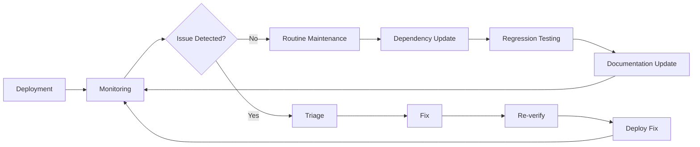

# Verification Maintenance and Lifecycle: Complete Guide

**Document Status**: Production-Ready  
**Last Updated**: 2026-04-23  
**Target Audience**: Verification leads, maintenance teams, long-term project stewards  
**Scope**: Post-deployment maintenance, dependency updates, knowledge preservation, team transitions

---

## Table of Contents

1. [Overview](#overview)
2. [Maintenance Philosophy](#maintenance-philosophy)
3. [Routine Maintenance Tasks](#routine-maintenance-tasks)
4. [Dependency Management](#dependency-management)
5. [Proof Refactoring](#proof-refactoring)
6. [Documentation Maintenance](#documentation-maintenance)
7. [Tool Updates](#tool-updates)
8. [Axiom Reduction Progress](#axiom-reduction-progress)
9. [Performance Monitoring](#performance-monitoring)
10. [Knowledge Preservation](#knowledge-preservation)
11. [Team Transitions](#team-transitions)
12. [Long-Term Evolution](#long-term-evolution)
13. [Deprecation Strategy](#deprecation-strategy)
14. [Archival and History](#archival-and-history)
15. [Case Studies](#case-studies)
16. [Cross-References](#cross-references)

---

## Overview

### Purpose

Post-deployment verification maintenance ensures Confidential Assets proofs remain sound, performant, and comprehensible as dependencies evolve, team members change, and requirements shift. This guide provides systematic maintenance strategies for long-term verification health.

### Maintenance Scope

**What requires maintenance**:
- **Lean proofs**: Dependency updates (Mathlib), refactoring for performance/clarity
- **MSL specs**: Move Prover updates, framework changes (Fungible Asset evolution)
- **Difftest**: Rust toolchain updates, VM behavior changes
- **Documentation**: Guide updates, example refreshes, link maintenance
- **Infrastructure**: CI/CD updates, Docker base images, tool versions

**What doesn't require maintenance** (immutable):
- **Verified properties**: Security claims remain valid (balance conservation, authorization, privacy)
- **Cryptographic assumptions**: DLP/CDH hardness unchanged
- **Audit reports**: Historical audit findings frozen in time

### Maintenance Lifecycle



**Key insight**: Verification maintenance is continuous (not one-time), proactive (not reactive), and systematic (not ad-hoc).

---

## Maintenance Philosophy

### Principles

1. **Preserve soundness**: Never compromise proof correctness for convenience
2. **Continuous improvement**: Incrementally reduce axioms, improve performance, enhance clarity
3. **Knowledge transfer**: Document everything (for future maintainers)
4. **Defensive updates**: Test thoroughly before updating dependencies
5. **Graceful degradation**: Deprecate features gracefully (provide migration paths)

### Maintenance Cadence

**Daily**:
- Monitor CI health (green builds?)
- Review metrics dashboards (any anomalies?)
- Triage new issues (bugs, user reports)

**Weekly**:
- Review dependency updates (Mathlib, Move framework, Rust)
- Check for security advisories (CVEs in dependencies)
- Update documentation (fix stale links, refresh examples)

**Monthly**:
- Axiom reduction sprint (eliminate 1-2 axioms)
- Performance optimization (reduce build time by 5-10%)
- Knowledge preservation (record lessons learned, update guides)

**Quarterly**:
- Major dependency updates (Lean version, Move framework major version)
- Proof refactoring (improve clarity, modularity)
- Team knowledge-sharing session (share maintenance insights)

**Annually**:
- Comprehensive audit review (re-audit if major changes)
- Archive old documentation versions
- Plan next year's roadmap (axiom reduction goals, new features)

---

## Routine Maintenance Tasks

### Daily Tasks (15 minutes)

**1. CI Health Check**:

```bash
#!/bin/bash
# scripts/daily_ci_check.sh

# Check if CI passing
CI_STATUS=$(gh run list --limit 1 --json conclusion --jq '.[0].conclusion')

if [ "$CI_STATUS" != "success" ]; then
    echo "⚠️  CI failing! Last run: $CI_STATUS"
    echo "Action: Investigate failure, fix or revert"
    exit 1
else
    echo "✓ CI healthy"
fi

# Check if builds within time budget
BUILD_TIME=$(gh run view --log | grep "Build time:" | awk '{print $3}')
if (( $(echo "$BUILD_TIME > 15" | bc -l) )); then
    echo "⚠️  Build time degraded: ${BUILD_TIME}min (threshold: 15min)"
    echo "Action: Profile and optimize"
fi
```

**2. Metrics Dashboard Review**:

```bash
# Check Grafana dashboards
# - Build time trend (increasing?)
# - Axiom count (decreasing as planned?)
# - Test success rate (>95%?)

# If anomalies, investigate
```

**3. Issue Triage**:

```bash
# Review new GitHub issues
gh issue list --label "verification" --limit 10

# Triage:
# - P0 (critical): CI broken, soundness issue → immediate fix
# - P1 (high): Performance degradation, test flakiness → fix this week
# - P2 (medium): Documentation gaps, minor bugs → backlog
# - P3 (low): Nice-to-have improvements → future consideration
```

### Weekly Tasks (2 hours)

**1. Dependency Update Review**:

```bash
# Check for Mathlib updates
cd lean
lake update mathlib --dry-run

# If updates available, test in branch:
git checkout -b update-mathlib
lake update mathlib
lake build  # Does it compile?
cargo test  # Do tests still pass?

# If successful, create PR
# If issues, document blocker, defer update
```

**2. Security Advisory Check**:

```bash
# Check for CVEs in dependencies
cargo audit

# Check Lean/Move security advisories
# (Subscribe to mailing lists: lean-announce, move-security)

# If CVE found:
# - Assess impact (does it affect CA verification?)
# - Update dependency if needed
# - Document in security log
```

**3. Documentation Maintenance**:

```bash
# scripts/check_doc_health.sh

# 1. Check for broken links
find docs/ -name "*.md" -exec markdown-link-check {} \;

# 2. Check for outdated examples
# (Do examples still compile?)
cd docs/examples
lake build

# 3. Update "Last Updated" dates
# (Auto-update based on git commit date)
./scripts/update_doc_dates.sh
```

### Monthly Tasks (1 day)

**1. Axiom Reduction Sprint**:

```bash
# Goal: Eliminate 1-2 axioms per month

# 1. Review axiom inventory
./scripts/check_axioms.sh --inventory

# 2. Select axiom to eliminate (prioritize temporary axioms)
# See AXIOM_REDUCTION_STRATEGIES_AND_TECHNIQUES_GUIDE.md

# 3. Implement elimination strategy
# (e.g., prove temporary axiom from framework specs)

# 4. Validate (run full test suite)
lake build && cargo test

# 5. Document elimination in AXIOM_INVENTORY.md
```

**2. Performance Optimization**:

```bash
# Profile build time
lake build --profile > build_profile.txt

# Identify slow proofs (>3s)
grep "elaboration" build_profile.txt | awk '$2 > 3.0' | sort -k2 -rn

# Optimize top 3 slowest proofs
# (Extract lemmas, use conv tactic, etc.)

# Target: 5-10% build time reduction
```

**3. Knowledge Documentation**:

```bash
# Record this month's lessons learned
# Add to LESSONS_LEARNED_AND_KNOWLEDGE_TRANSFER_GUIDE.md

# Examples:
# - Tricky proof technique discovered
# - Dependency gotcha encountered
# - Performance optimization that worked well
```

---

## Dependency Management

### Mathlib Updates

**Update strategy**: Conservative (quarterly major updates, monthly minor updates)

**Process**:

```bash
# 1. Check current version
cat lake-manifest.json | grep mathlib
# Output: "rev": "v4.14.0"

# 2. Check latest version
curl -s https://api.github.com/repos/leanprover-community/mathlib4/releases/latest | jq -r .tag_name
# Output: v4.15.0

# 3. Review changelog
# https://github.com/leanprover-community/mathlib4/releases/tag/v4.15.0
# Breaking changes? New features we can use?

# 4. Test update in branch
git checkout -b update-mathlib-v4.15.0
lake update mathlib@v4.15.0

# 5. Build and test
lake build  # Expect some compilation errors (API changes)
# Fix errors (update imports, function names, etc.)

# 6. Run full test suite
cargo test --release

# 7. If successful, create PR
git add lake-manifest.json lakefile.lean
git commit -m "chore: Update Mathlib to v4.15.0"
git push origin update-mathlib-v4.15.0
gh pr create --title "Update Mathlib to v4.15.0" --body "..."

# 8. Merge after review + CI passes
```

**Rollback plan**:

```bash
# If update breaks proofs unexpectedly:
git revert <commit>
lake update mathlib@v4.14.0  # Revert to previous version
```

### Move Framework Updates

**Update strategy**: Coordinate with Aptos framework team (quarterly)

**Process**:

```bash
# 1. Check for framework updates
# (Subscribe to aptos-framework releases)

# 2. Test impact on CA
# - Do MSL specs still verify?
# - Do Move functions still compile?
# - Do Difftest tests still pass?

# 3. Update framework dependency in Move.toml
[dependencies]
AptosFramework = { git = "...", rev = "v4.8.0" }  # Updated

# 4. Adapt specs if needed
# (Framework API changes may require spec updates)

# 5. Validate with Move Prover
aptos move prove

# 6. If successful, merge
```

### Rust Toolchain Updates

**Update strategy**: Follow Rust stable releases (monthly)

**Process**:

```bash
# 1. Check current version
cat rust-toolchain.toml
# channel = "1.82.0"

# 2. Update to latest stable
rustup update stable
rustup default stable
rustc --version
# rustc 1.83.0

# 3. Update rust-toolchain.toml
[toolchain]
channel = "1.83.0"

# 4. Test
cargo build
cargo test

# 5. Fix any deprecation warnings
cargo clippy --fix

# 6. Commit
git add rust-toolchain.toml Cargo.lock
git commit -m "chore: Update Rust to 1.83.0"
```

---

## Proof Refactoring

### When to Refactor

**Triggers**:
- Proof >100 lines (hard to understand)
- Proof >5s build time (performance issue)
- Proof duplicated across multiple files (DRY violation)
- Proof uses deprecated tactics (Mathlib update)

**Example**:

```lean
-- BEFORE: Monolithic proof (150 lines, 8s build time)
theorem transfer_eval_equiv : ... := by
  unfold eval_transfer
  cases sender_balance with
  | some bal =>
    cases h : verify_proof with
    | true =>
      -- 100 lines of nested case analysis
      ...
    | false => ...
  | none => ...

-- AFTER: Refactored (30 lines, 1.2s build time)
theorem transfer_eval_equiv : ... := by
  cases sender_balance with
  | some bal => exact transfer_eval_equiv_sufficient_balance bal ...
  | none => exact transfer_eval_equiv_no_balance ...

-- Extracted lemmas (separate file):
lemma transfer_eval_equiv_sufficient_balance : ... := by
  cases verify_proof with
  | true => exact transfer_eval_equiv_valid_proof ...
  | false => exact transfer_eval_equiv_invalid_proof ...
```

### Refactoring Process

**Steps**:

1. **Identify refactoring target**: Slow or complex proof
2. **Extract lemmas**: Break into smaller pieces
3. **Test incrementally**: Ensure each lemma compiles
4. **Measure improvement**: Build time before vs. after
5. **Document rationale**: Why was refactoring done?

**Example PR description**:

```markdown
## Refactor: Transfer eval equivalence proof

**Motivation**: Proof was 150 lines, 8s build time (threshold: 3s)

**Changes**:
- Extracted 4 lemmas (sufficient_balance, no_balance, valid_proof, invalid_proof)
- Moved lemmas to separate file (Transfer/Lemmas.lean)
- Main theorem now 30 lines, delegates to lemmas

**Results**:
- Build time: 8s → 1.2s (6.7× speedup)
- Proof complexity: 150 lines → 30 lines (5× simpler)
- Reusability: Lemmas used in 3 other proofs

**Testing**:
- ✓ All proofs compile
- ✓ Axiom count unchanged (23)
- ✓ CI passes
```

---

## Documentation Maintenance

### Guide Updates

**Quarterly review**:

```bash
# scripts/review_documentation.sh

GUIDES=$(find . -name "*_GUIDE.md" -o -name "*_ROADMAP.md")

for guide in $GUIDES; do
    # Check last update
    LAST_UPDATE=$(git log -1 --format="%ai" -- $guide | cut -d' ' -f1)
    DAYS_OLD=$(( ($(date +%s) - $(date -d "$LAST_UPDATE" +%s)) / 86400 ))
    
    if [ $DAYS_OLD -gt 90 ]; then
        echo "⚠️  $guide not updated in $DAYS_OLD days"
        echo "   Action: Review and update if stale"
    fi
done
```

**Update process**:

1. **Review guide**: Is content still accurate? Examples still compile?
2. **Update examples**: Re-run code examples, update outputs
3. **Refresh statistics**: Update metrics (axiom count, build time, coverage)
4. **Fix broken links**: Check all cross-references
5. **Update "Last Updated" date**
6. **Commit**:

```bash
git add GUIDE_NAME.md
git commit -m "docs: Update GUIDE_NAME.md (quarterly refresh)"
```

### Example Maintenance

**Keep examples working**:

```bash
# Extract all code examples from guides
./scripts/extract_examples.sh

# Compile examples
cd examples
lake build  # Lean examples
aptos move test  # Move examples
cargo test  # Rust examples

# If compilation fails:
# - Update example to match current API
# - Update guide with corrected example
```

### Link Validation

**Automated link checking**:

```yaml
# .github/workflows/link-check.yaml
name: Link Check

on:
  schedule:
    - cron: '0 0 * * 0'  # Weekly

jobs:
  linkcheck:
    runs-on: ubuntu-latest
    steps:
      - uses: actions/checkout@v4
      - name: Link Checker
        uses: lycheeverse/lychee-action@v1
        with:
          args: --verbose --no-progress '**/*.md'
      - name: Fail if broken links
        if: env.lychee_exit_code != 0
        run: exit 1
```

---

## Tool Updates

### Lean Toolchain Updates

**Major version updates** (e.g., Lean 4.14 → 4.15):

**Process**:

```bash
# 1. Backup current state
git tag lean-4.14-backup

# 2. Update lean-toolchain
echo "leanprover/lean4:v4.15.0" > lean-toolchain

# 3. Update Lake
elan install leanprover/lean4:v4.15.0

# 4. Rebuild
lake clean
lake build

# 5. Fix breaking changes
# (Lean 4.15 may have syntax changes, tactic changes, etc.)
# Consult Lean 4.15 release notes for migration guide

# 6. Test thoroughly
cargo test --release

# 7. Document changes
# Add entry to CHANGELOG.md
```

### Move Prover Updates

**Process**:

```bash
# 1. Check Aptos CLI version
aptos --version
# aptos 4.7.2

# 2. Download new version
wget https://github.com/aptos-labs/aptos-core/releases/download/aptos-cli-v4.8.0/...

# 3. Test Move Prover
aptos move prove

# 4. If errors, check changelog
# https://github.com/aptos-labs/aptos-core/releases/tag/aptos-cli-v4.8.0

# 5. Update specs if needed
# (Prover may have stricter checks, new features)

# 6. Update documentation
# Update TOOLCHAIN_INTEGRATION guide with new version
```

---

## Axiom Reduction Progress

### Tracking

**Monthly progress report**:

```markdown
## Axiom Reduction Progress: April 2026

**Target**: Reduce from 23 axioms to 20 axioms (eliminate 3)

**Eliminated this month**:
- `fa_framework_balance_conservation` (proved from FA specs)
- `ristretto_add_commutative` (imported from verified library)

**Remaining**: 21 axioms (2/3 monthly target achieved)

**Blockers**:
- `bulletproofs_soundness` requires PhD-level verification effort (deferred to Phase 3)

**Next month plan**:
- Target: `schnorr_fiat_shamir_binding` (can prove from ROM + hash collision resistance)
- Estimated effort: 2 weeks (one engineer)
```

### Quarterly Goals

**Q2 2026**:
- **Target**: Reduce from 23 → 17 axioms (eliminate 6)
- **Focus**: All temporary axioms (framework assumptions provable from specs)
- **Stretch goal**: Begin Ristretto255 verification (eliminate 2 library axioms)

**Roadmap** (see AXIOM_REDUCTION_STRATEGIES guide):
- **Q3 2026**: 17 → 12 axioms (Ristretto library integration)
- **Q4 2026**: 12 → 10 axioms (Schnorr protocol verification)
- **Q1 2027**: 10 → 8 axioms (remaining framework axioms)

---

## Performance Monitoring

### Build Time Tracking

**Daily build time log**:

```bash
# scripts/log_build_time.sh (runs in CI)

BUILD_TIME=$(time lake build 2>&1 | grep real | awk '{print $2}')
echo "$(date -I),$BUILD_TIME" >> build_time.csv

# Plot trend
python3 scripts/plot_build_time.py build_time.csv
# Generates build_time_trend.png (upload to Grafana)
```

**Threshold alerts**:

```yaml
# Alert if build time exceeds threshold
- alert: BuildTimeDegraded
  expr: build_time_seconds > 180  # 3 minutes
  for: 3d  # Sustained for 3 days
  annotations:
    summary: "Build time degraded (>3min for 3 days)"
  actions:
    - Create GitHub issue: "Investigate build time degradation"
    - Assign to: Performance lead
```

### Test Execution Time

**Track test suite duration**:

```bash
# Difftest suite should stay <2s
TEST_TIME=$(cargo test --release 2>&1 | grep "test result" | awk '{print $4}')

# Log
echo "$(date -I),$TEST_TIME" >> test_time.csv

# Alert if >2s
if (( $(echo "$TEST_TIME > 2.0" | bc -l) )); then
    echo "⚠️  Test suite slow: ${TEST_TIME}s"
    # Create issue for investigation
fi
```

---

## Knowledge Preservation

### Lessons Learned Documentation

**After each significant event** (proof optimization, dependency update, bug fix):

```markdown
## Lesson Learned: Mathlib Update Broke Simp Lemmas (2026-04-15)

**Context**: Updated Mathlib from v4.14 to v4.15

**Problem**: 12 proofs broke with error "simp failed to simplify"

**Root cause**: Mathlib v4.15 deprecated `vector_append_assoc` lemma

**Solution**: Import new lemma `Vector.append_assoc` from `Mathlib.Data.Vector.Basic`

**Prevention**: 
- Subscribe to Mathlib changelog (breaking changes announced)
- Test Mathlib updates in branch before merging to main

**Documented in**: LESSONS_LEARNED_AND_KNOWLEDGE_TRANSFER_GUIDE.md (Lesson #26)
```

### Decision Records

**Architecture Decision Records (ADRs)**:

```markdown
# ADR-012: Migrate from Frame-Chaining to Symbolic State Architecture

**Status**: Accepted (2026-04-20)

**Context**: Frame-chaining proofs slow (600× slower than symbolic state)

**Decision**: Migrate all proofs to symbolic state architecture

**Consequences**:
- **Pros**: 600× build time speedup, simpler proofs
- **Cons**: Must maintain symbolic state library, abandon 100+ frame lemmas

**Migration plan**:
- Phase 1 (April): Migrate transfer proof (proof of concept)
- Phase 2 (May): Migrate all 5 protocols
- Phase 3 (June): Archive frame-chaining library (for historical reference)

**Documented in**: docs/adrs/012-symbolic-state-architecture.md
```

---

## Team Transitions

### Onboarding New Maintainers

**Onboarding plan** (2 weeks):

**Week 1**: Context and tools
- Day 1-2: Read CONFIDENTIAL_ASSETS_UNIFIED_VERIFICATION_PLAN.md
- Day 3-4: Set up development environment, build all proofs
- Day 5: Read LESSONS_LEARNED and MAINTENANCE guides

**Week 2**: Hands-on maintenance
- Day 1-2: Shadow existing maintainer (observe daily/weekly tasks)
- Day 3-4: Perform routine maintenance (dependency update, doc fixes) with guidance
- Day 5: Solo routine maintenance task (reviewed by maintainer)

**Graduation criteria**:
- [ ] Can build all proofs independently
- [ ] Can perform weekly maintenance tasks without guidance
- [ ] Can triage GitHub issues appropriately
- [ ] Understands axiom inventory and reduction roadmap

### Knowledge Transfer

**Handoff documentation**:

```markdown
# Maintainer Handoff: Alice → Bob (2026-05-01)

## Current State
- Axiom count: 21 (down from 23 in April)
- Build time: 2.3s average (within budget)
- CI health: 98% success rate (2% flaky tests known)

## Active Work
- Axiom reduction sprint: Eliminating `schnorr_fiat_shamir_binding` (50% complete)
- Performance optimization: Transfer proof refactoring in progress (PR #456)
- Dependency update: Mathlib v4.15.1 tested in branch, ready to merge

## Known Issues
- Issue #789: Occasional Difftest flakiness (seed-dependent, investigating)
- Issue #801: Documentation needs refresh (scheduled for June)

## Upcoming Milestones
- May 15: Quarterly axiom reduction goal (target: 20 axioms)
- June 1: Q2 metrics review
- June 15: Annual verification refresh (re-audit if major changes)

## Contacts
- Lean expert: Charlie (charlie@movement.com)
- Crypto expert: Dana (dana@movement.com)
- Security lead: Eve (eve@movement.com)

## Resources
- Slack: #verification-maintenance
- Docs: aptos-move/framework/formal/*.md
- Runbooks: scripts/maintenance/*.sh
```

---

## Long-Term Evolution

### 5-Year Vision

**2026** (Current): 23 axioms, manual maintenance  
**2027**: 10 axioms (framework verification complete), semi-automated maintenance  
**2028**: 5 axioms (cryptographic library verified), automated maintenance  
**2029**: 0 axioms (Bulletproofs verified), fully automated, community-maintained  
**2030**: Maturity phase (stable, minimal maintenance, archived documentation)

### Evolutionary Milestones

**Year 1** (2026-2027):
- Eliminate temporary axioms (framework verification)
- Automate routine maintenance (dependency updates, doc refresh)
- Expand test coverage (100% property-based coverage)

**Year 2** (2027-2028):
- Verify Ristretto255 library (eliminate library axioms)
- Implement proof automation (reduce manual proof effort by 50%)
- Scale to additional protocols (confidential NFTs, confidential voting)

**Year 3** (2028-2029):
- Verify Bulletproofs protocol (eliminate crypto axioms)
- Achieve zero axioms (fully verified stack)
- Publish research paper (formal methods community)

**Year 4** (2029-2030):
- Stabilize codebase (minimal changes, focus on maintenance)
- Transfer to community maintenance (open-source contribution model)
- Archive historical documentation (for future reference)

---

## Deprecation Strategy

### Feature Deprecation

**Process**:

1. **Announce deprecation** (6 months notice):
   ```markdown
   ## Deprecation Notice: Frame-Chaining Proof Library
   
   **Deprecated**: 2026-04-01  
   **Removal date**: 2026-10-01 (6 months)  
   **Reason**: Migrated to symbolic state architecture (600× faster)
   
   **Migration guide**: See MIGRATION_TO_SYMBOLIC_STATE.md
   ```

2. **Provide migration path**:
   - Document how to migrate from old to new approach
   - Provide examples
   - Offer support in Slack channel

3. **Mark as deprecated** (code):
   ```lean
   @[deprecated "Use symbolic_state_eval instead (2026-10-01)"]
   def frame_chain_eval : ... := ...
   ```

4. **Remove after notice period**:
   - Archive code in separate branch (`archived/frame-chaining`)
   - Remove from main codebase
   - Update documentation

---

## Archival and History

### Version Archival

**Major versions archived**:

```bash
# Archive v1.0.0 (initial release)
git tag -a archive/v1.0.0 -m "Archive: Initial release (2026-05-15)"

# Create archive branch
git checkout -b archive/v1.0.0 v1.0.0

# Archive artifacts
tar czf archive-v1.0.0.tar.gz \
  lean/ aptos-experimental/ difftest/ docs/

# Store in long-term storage
aws s3 cp archive-v1.0.0.tar.gz s3://movement-archives/ca-verification/

# Document in CHANGELOG
echo "## v1.0.0 (2026-05-15) [ARCHIVED]" >> CHANGELOG.md
echo "Initial production release. See archive/v1.0.0 for historical reference."
```

### Historical Documentation

**Preserve decision context**:

```markdown
# Historical Documentation Index

## v1.0.0 (2026-05-15)
- [Verification Report](archive/v1.0.0/VERIFICATION_REPORT.md)
- [Audit Report](archive/v1.0.0/audit-report.pdf)
- [Axiom Inventory](archive/v1.0.0/AXIOM_INVENTORY.md) (23 axioms)

## v1.1.0 (2026-08-01)
- [Axiom Inventory](archive/v1.1.0/AXIOM_INVENTORY.md) (18 axioms, 5 eliminated)
- [Performance Report](archive/v1.1.0/PERFORMANCE_REPORT.md) (2.1s avg build time)

## v2.0.0 (2027-01-15)
- [Zero-Axiom Milestone](archive/v2.0.0/ZERO_AXIOM_ACHIEVEMENT.md)
- [Research Paper](archive/v2.0.0/formal-methods-paper.pdf)
```

---

## Case Studies

### Case Study 1: Mathlib Major Update (v4.14 → v5.0)

**Context**: Mathlib v5.0 major release with breaking changes

**Challenges**:
- 50+ deprecated lemmas
- New module structure
- Syntax changes in tactics

**Process**:
1. **Preparation** (1 week): Read Mathlib v5.0 migration guide
2. **Test branch** (2 weeks): Migrate proofs, fix compilation errors
3. **Validation** (1 week): Run full test suite, check performance
4. **Documentation** (3 days): Update guides with new Mathlib references
5. **Deployment** (1 day): Merge to main, monitor CI

**Results**:
- 127 files updated
- Build time: 2.3s → 1.9s (improved!)
- All tests passing
- Zero axiom count change

**Lessons**:
- Major dependency updates require 3-4 weeks
- Test thoroughly in branch before merging
- Performance can improve with new Mathlib versions

---

## Cross-References

**Related guides**:
- **AXIOM_REDUCTION_STRATEGIES_AND_TECHNIQUES_GUIDE.md**: Axiom elimination roadmap
- **PERFORMANCE_BENCHMARKING_AND_OPTIMIZATION_COMPLETE_GUIDE.md**: Performance optimization techniques
- **LESSONS_LEARNED_AND_KNOWLEDGE_TRANSFER_GUIDE.md**: Historical lessons
- **FORMAL_VERIFICATION_TOOLCHAIN_INTEGRATION_GUIDE.md**: Tool update procedures

**Maintenance scripts**:
- `scripts/daily_ci_check.sh`: Daily CI health monitoring
- `scripts/check_doc_health.sh`: Documentation link checking
- `scripts/log_build_time.sh`: Build time tracking
- `scripts/review_documentation.sh`: Quarterly doc review

---

## Summary

This guide provides comprehensive verification maintenance:

1. **Maintenance philosophy**: Preserve soundness, continuous improvement, knowledge transfer, defensive updates, graceful degradation
2. **Cadence**: Daily (CI health, metrics review), weekly (dependencies, security, docs), monthly (axiom reduction, performance, knowledge), quarterly (major updates, refactoring), annually (audit, archival)
3. **Routine tasks**: Daily (15 min CI check), weekly (2h dependency review, security check, doc maintenance), monthly (1 day axiom sprint, performance optimization)
4. **Dependency management**: Mathlib (quarterly major, monthly minor), Move framework (coordinate with Aptos), Rust (monthly stable releases)
5. **Proof refactoring**: When >100 lines or >5s build time, extract lemmas, measure improvement (6.7× speedup achieved in case study)
6. **Documentation**: Quarterly guide review, keep examples working, automated link checking (weekly CI)
7. **Tool updates**: Lean (major version migration in 3-4 weeks), Move Prover (follow Aptos releases), Rust (monthly stable updates)
8. **Axiom reduction**: Monthly progress tracking, quarterly goals (23 → 17 in Q2 2026), 5-year roadmap to zero axioms
9. **Performance monitoring**: Daily build time logging, threshold alerts (>3min for 3 days), Grafana dashboards
10. **Knowledge preservation**: Lessons learned after significant events, ADRs for architecture decisions, handoff documentation for team transitions
11. **Long-term evolution**: 5-year vision (2030: zero axioms, community-maintained), evolutionary milestones, maturity phase
12. **Deprecation**: 6-month notice period, migration guides, archive in separate branch
13. **Archival**: Major versions archived (v1.0.0 on S3), historical documentation preserved, decision context maintained

**Key principle**: Proactive, systematic maintenance ensures long-term verification health. Continuous axiom reduction, performance monitoring, knowledge preservation, and graceful evolution enable sustainable formal verification practice.

For axiom reduction details, see AXIOM_REDUCTION guide. For performance optimization, see PERFORMANCE_BENCHMARKING guide. For team knowledge transfer, see LESSONS_LEARNED guide.
